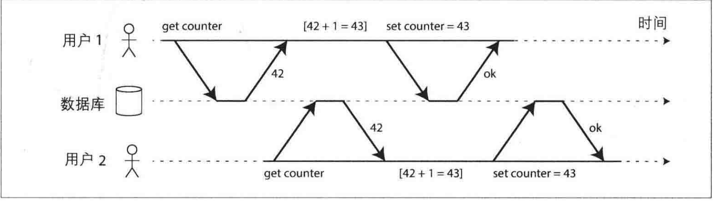
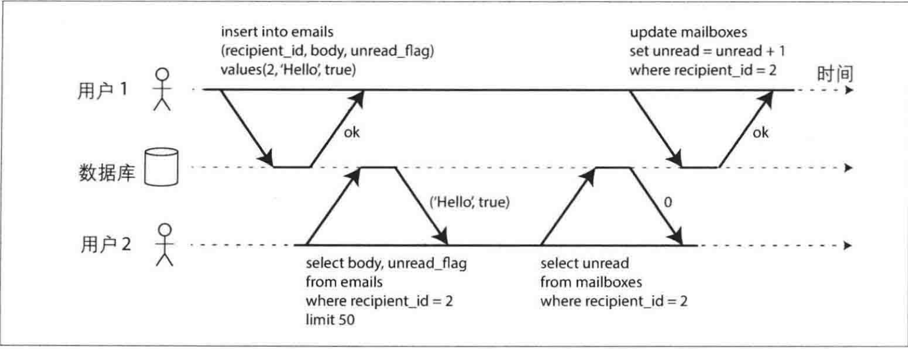
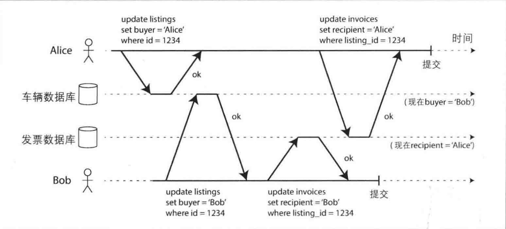
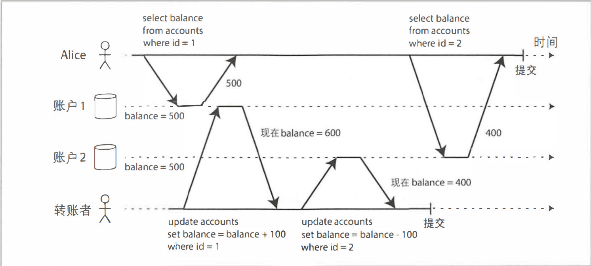

在一个苛刻的数据存储环境中，可能会出现很多情况：
- 数据库软件硬件随时失效
- 应用程序崩溃
- 节点之间相互失联
- 由于边界条件竞争引入各种奇怪的问题

事务将应用程序的多个读、写操作捆绑在一起成为一个逻辑操作单元，整个事务要么全部成功、要么失败，从而简化错误处理。

<!--more-->

传统关系型数据库（如MySQL、PostgreSQL、Oracle、SQL Server）的事务处理机制是成熟且稳定的。几乎所有的关系数据库和一些非关系数据库都支持事务处理，且大多数的设计理念来源于1975年IBM推出第一个SQL数据库System R。

21世纪末随着非关系（NoSQL）数据库的兴起，这类数据库通过提供新的 [数据模型](./Model.md)、[复制](./copy.md) 和 [分区](./partition.md) 等功能来改进传统关系模型。但在这一变革中，很多新一代的数据库完全放弃事务，或重新定义为比以前弱得多的保证。

为了更深入的理解事务，让我们考虑在正常运行和各种极端情况下，事务所能提供的保证

## ACID的含义

事务所提供的安全保证即大家所熟知的ACID,分别代表 原子性(Atomicity)、一致性(Consistency)、隔离性(Isolation)、持久性(Durability)

### 原子性
在多线程编程中，原子性指的是一个操作在执行过程中不会被其他线程看到其中间状态，这意味着其他线程只能看到该操作执行或未执行。

而在数据库系统的 ACID 原则中，原子性有所不同。它关注的是事务中包含的多个操作作为一个整体执行。如果事务中的某个操作失败，整个事务会被中止，并且回滚所有已经执行的操作，确保不留下任何中间状态的痕迹。

原子性的重要性在于，它简化了错误处理。确保所有更改要么全部执行，要么全部不执行，让应用程序能够安全地重试操作，避免了重复更新或错误结果的风险。

### 一致性

一致性非常重要，但它在不同的场景却有着不同的具体含义

- [数据复制](./copy.md) 一文中探讨了副本一致性以及在异步复制时，引出的最终一致性
- 一致性哈希则是某些系统用于动态分区再平衡的方法
- CAP理论中，一致性用来表示线性化
- 而在ACID中，一致性主要指的是数据库处于应用程序所期待的“预计状态”

那如何达到应用程序所期待的“预计状态”呢？例如：对于一个账单系统,账户的贷款余额应和借款余额保持平衡。如果某事务从一个有效的状态开始,并且事务中任何更新操作都没有违背约束,那么最后的结果依然符合有效状态。

作者认为：这种一致性本质上是要求应用层来维护状态一致性，应用程序有责任正确的定义事务来保证一致性。
```txt
这种一致性本质上要求应用层来维护状态一致(或者恒等) ,应用程序有责任正确地定义事务来保持一致性。
这不是数据库可以保证的事情: 即如果提供的数据修改违背了恒等条件,数据库很难检测进而阻止该操作(数据库可以完成针对某些特定类型的恒等约束检查,例如使用外键约束或唯一性约束。但通常主要靠应用程序来定义数据的有效/无效状态,数据库主要负责存储) 。
原子性,隔离性和持久性是数据库自身的属性,而ACID中的一致性更多是应用层的属性。
应用程序可能借助数据库提供的原子性和隔离性,以达到一致性,但一致性本身并不源于数据库。因此,字母C其实并不应该属于ACID。
```

### 隔离性

隔离性要求并发执行的多个事务必须互不干扰，即使它们实际上可能是同时运行的。即系统保证事务执行的结果与它们串行执行（一个接一个执行）的结果完全相同。

例如：当两个客户端同时试图更新同一个数据（如一个计数器）时。在没有适当的并发控制机制的情况下，这种操作可能会导致竞争条件，结果是数据更新不正确。



### 持久性

持久性被定义为一旦事务成功提交，数据就应该被永久保存，即使发生硬件故障或数据库崩溃，数据也不应丢失。

在单节点数据库中，这通常意味着数据被写入非易失性存储设备如硬盘或SSD，并通过技术如预写日志来确保数据在故障时可以恢复。对于多节点数据库，持久性还包括将数据成功复制到多个节点。

## 单对象与多对象事务操作

### 多对象事务操作

多对象事务通常指的是在一个事务中会修改多个对象(行，文档，记录等)，它的目的通常是为了在多个数据对象之间保持同步。

我们先来看看如果多对象事务未提供隔离性会如何？\
在你的系统当中，会显示你所收到的电子邮件，与此同时，为了方便查看未读邮件的个数，设置一个字段来记录个数，每新受到一个邮件则增加该计数，当邮件标记为已读，则减少该计数器。



所以对于用户1来说这边是一个多对象事务操作，先发送一个新的邮件，再更新未读计数。但是对于用户2来说，发生了一个奇怪的现象：明明收到了邮件，但是未读计数却依然是0

很明显，可能由于网络波动，或者其他原因导致用户2的第二次查询在更新计数之前发生。用户2的事务读取了另一个事务中尚未提交的写入(脏读)，这便违反了隔离性。

### 单对象写入

原子性和隔离性也同样适用于单个对象的更新，存储引擎几乎必备的设计就是在单节点、单个对象层面上提供原子性和隔离性。例如,出现宕机时,基于日志恢复来实现原子性，对每个对象采用加锁的方式每次只允许一个线程访问对象来实现隔离。

一些数据库提供了原子自增操作和原子比较-设置（compare-and-set）操作，这些操作可以在不进行传统的读取-修改-写回周期的情况下更新数据。比如，原子比较-设置操作确保只有在当前值未被其他操作更改的情况下，才会执行写入操作，这有助于防止并发环境中的更新丢失。

## 弱隔离级别

如果两个事务操作的是不同的数据,即不存在数据依束关系,则它们可以安全地并行执行。只有出现某个事务修改数据而另一个事务同时要读取访数据,或者两个事务同时修改相同数据时,才会引发并发问题。

实现隔离性绝不是想象的那么简单。可串行化的隔离会严重影响性能,而许多数据库却不愿意牺牲性能,因而更多倾向于采用较弱的隔离级别,它可以防止某些但并非全部的并发问题。

下面将介绍几个实际经常用得到的弱级别隔离

### 读-提交

读-提交提供以下两个保证：
1. 读数据库时,只能看到已成功提交的数据 (防止“脏读”) 。
2. 写数据库时,只会覆盖已成功提交的数据 (防止“脏写”) 。

```
通俗来讲，读提交体现在两个事务并发操作：
事务 A 在修改对象，如果另一个事务 B 在读取对象，可以读到 A 未提交的数据，则就是脏读。
如果 B 在修改对象，修改值可以覆盖 A 未提交的数据，则就是脏写。
```

#### 防止脏读

防止脏读，意味着事务的任何写入只有在成功提交之后，才会被其他人观察到


用户1设置了x = 3,在用户1的事务未提交之前,用户2获取的值依然是旧值2。

#### 防止脏写

如果两个事务同时尝试更新相同的对象， 会发生什么情况呢？我们不清楚写入的顺序， 但可以想象后写的操作会覆盖较早的写入。

但是， 如果先前的写入是尚未提交事务的一部分， 是否还是被覆盖？如果是， 那就是脏写。防止脏写，意味着更新相同对象的两个事务，后写的操作不能覆盖较早还未提交事务的写入。



如图所示，Alice与Bob同时购买同一辆车，则对应两次数据库写入，如果无法避免脏读，就会出现车主是Bob(更新了车辆表单)，发票是Alice(后更新了发票表单)

#### 实现读-提交

数据库通常采用行级锁来防止脏写: 当事务想修改某个对象(例如行或文档时),它必须首先获得该对象的锁,然后一直持有锁直到事务提交 (或中止) 。给定时刻,只有一个事务可以拿到特定对象的锁,如果有另一个事务尝试更新则一个对象,则必须等待,直到前面的事务完成了提交 (或中止) 后,才能获得锁并继续。

那如何防止脏读呢? 一种选择是使用相同的锁,所有试图读取该对象的事务必须先申请锁,事务完成后释放锁。然而,读锁的方式在实际中并不可行,因为运行时间较长的写事务会导致许多只读的事务等待太长时间。

对于每个待更新的对象,数据库都会维护其旧值和当前持锁事务将要设置的新值两个版本。在事务提交之前,所有其他读操作都读取旧值,仅当写事务提交之后,才会切换到读取新值。

### 快照级别隔离与可重复读

表面上看读－提交级别隔离,已经可以解决很多场景下的问题了： 它支持中止（原子性所必须的），可以防止读取不完整的结果，并且防止并发写的混合。

但是，在使用此隔离级别时，仍然有很多场景可能导致并发错误。



假设Alice在银行有1000美元的存款，分为两个账户，每个500美元。现在从 账户2转到账户1。如果她查看账户的时机特别巧合：在她提交转账请求后，但是银行数据库正在执行中.她有可能会看到账号2依然是500美元，但是转账1却变为了400美元。对于Alice来说，貌似她的账户总共只有900美元，有100美元消失了。

这种现象称为不可重复读，如果Alice再次读取账户1的余额，她将看到正确的数据 600。对于这种现象，一些条件下是可以接受的(比如本例)，我只需要刷新页面可能就能正确的显示，但是却有一些场景并不能容忍这种不可重复读现象。

1. 备份场景\
    备份任务要复制整个数据库，这可能需要数小时才能完成。在备份过程中， 可以继续写入数据库。 因此，得到镜像里可能包含新旧版本数据。如果备份的时机像 Alice 那样巧合，最后备份的数据将会导致永久性的不一致。
2. 分析查询与完整性检查场景\
   在分析业务中，有时查询可能会扫描几乎大半个数据库。亦或定期的数据完整性检查。如果这些查询在不同时间点观察数据库，可能会返回无意义的结果。

快照级别隔离这是解决上述问题最常见的手段。其总体想法是：每个事务都从数据库的一致性快照中读取，事务所看到是最近已经提交的数据， 即使数据随后可能被另一个事务更改，但保证每个事务都只看到该特定时间点的旧数据。

### 实现快照级别隔离

为了实现快照级别隔离，数据库采用了一种类似于上面防止脏读(保留不同的版本数据)但却更为通用的机制。考虑到多个正在进行的事务可能会在不同的时间点查看数据库状态，所以数据库保留了对象多个不同的提交版本，这种技术因此也被称为多版本并发控制(MultiVersion Concurrency Control, MVCC)。

如果只是为了提供读－提交级别隔离，而不是完整的快照级别隔离， 则只保留对象的两个版本就足够了： 一个已提交的旧版本和尚未提交的新版本。 所以，支持快照级别隔离的存储引擎往往直接采用MVCC来实现读－提交隔离。 

不同之处在于：在读－提交级别下，对每一次不同的查询都单独创建一个快照；而快照级别隔离则是使用一个快照来运行整个事务。

### 索引与快照级别隔离

这种多版本数据库该如何支持索引呢？

一种方案是索引直接指向对象的所有版本，然后想办法过滤对当前事务不可见的那些版本。 当后台的垃圾回收进程决定删除某个旧对象版本时，对应的索引条目也需要随之删除。

另一种方式是对于 B-tree 的存储结构采用追加/写时复制的技术，当需要更新时，不会修改现有的页面，而总是创建一个新的修改副本，拷贝必要的内容, 那些不受更新影响的页面都不需要复制。 

这种采用追加式的B-tree, 每个写入事务都会创建一个新的B-tree root, 代表该时刻数据库的一致性快照。 这时就没有必要根据事务ID再去过滤掉某些对象。采用这种方法依然需要后台进程来执行压缩和垃圾回收。

### 防止更新丢失

上面所讨论的读－提交和快照级别隔离主要都是为了解决只读事务遇到并
发写时可以看到什么，但是还没有触及另一种情况， 即两个写事务并发。

更新丢失问题是事务并发中的一个常见冲突，发生在多个事务并发操作同一数据对象时，特别是在“读-修改-写回”操作过程中。由于事务隔离性，一个事务的修改可能会被另一个事务的写操作覆盖，导致更新丢失。解决方法包括：

1. 原子写操作：许多数据库提供了原子更新操作， 以避免在应用层代码完成 “读－修改－写回“ 操作，例如， 下面的指令在多数关系数据库中都是并发安全的：
```sql
UPDATE counters SET value= value+ 1 WHERE key='foo';
```
2. 显式加锁：通过显式锁定待更新的对象，防止并发事务覆盖更新。
```sql
BEGIN TRANSACTION;

SELECT* FROM figures
WHERE name = 'robot' AND game_id = 222
FOR UPDATE;

UPDATE figures SET position = 'c4' WHERE id= 1234;

COMMIT; 
```
在一个事务当中，FOR UPDATE 会对数据库返回的所有结果加锁。直至数据库回滚或事务提交。

3. 自动检测更新丢失：依赖数据库的隔离级别自动检测并阻止更新丢失。

与乐观锁类似，一种思路是是先让他们并发执行， 但如果事务管理器检测到了更新丢失风险, 则会中止当前事务，并强制回退到安全的 “读－修改－写回” 方式。

4. CAS(原子比较和设置)：在更新操作前进行比较，确保数据未被其他事务更改，适用于不支持事务的数据库。

### 写倾斜与幻读

写倾斜：这种情况发生在多个事务同时更新不同的对象时，虽然每个事务独立来看是合法的，但它们的并发执行可能导致违反业务规则的状态。例如，两个医生同时申请请假，系统允许了他们的请求，但最终导致没有医生值班，违背了至少一名医生必须值班的规则。

```
上面的隔离级别解决的是不同事务对于同一个对象读/写的状态
而写倾斜，幻读体现在多个事务更新不同的对象时，虽然事务之间彼此独立，但是逻辑上存在一定的约束关系。
```

写倾斜产生的根本原因是由于事务在执行过程中，先进行查询操作并根据查询结果决定后续操作，但这些操作（如插入、更新或删除）会改变查询结果的前提条件，导致数据的不一致。

这种在一个事务中的写入改变了另一个事务查询结果的现象，称为幻读。快照级别隔离可以避免只读查询时的幻读，但是对于我们上面所讨论那些读－写事务， 它却无法解决棘手的写倾斜问题。在大多数情况下，可串行化隔离方案更为可行。

## 强隔离级别

### 串行化

采用读－提交和快照隔离可以防止其中一部分，但并非对所有情况都有效， 例如写倾斜和幻读所导致的棘手问题。

目前大多数提供可串行化的数据库都使用了以下三种技术之一
- 串行顺序执行
- 两阶段锁
- 乐观并发控制技术

#### 串行顺序执行

过去，多线程并发被认为是提升性能的关键，但也带来了复杂的并发控制问题。但是随着
- 内存价格下降容量增加：可以将整个活动数据集加载到内存中，减少了磁盘I/O的延迟，使事务执行更快。
- OLTP事务特点：OLTP事务通常简单且快速，主要执行少量的读写操作，这使得它们更适合在单线程中执行。

例如 Redis 采用单线程串行执行事务，避免了多线程并发中的锁开销和复杂的并发控制。

单线程执行的吞吐量受限于单个CPU核，不能满足高并发写入需求。为了扩展到多个CPU核和多节点，可以对数据进行分区。如果能找到一个方法来对数据集进行分区， 使得每个事务只在单个分区内读写数据， 这样每个分区都可以有自己的事务处理线程且独立运行。 此时为每个CPU核分配一个分区， 则数据库的总体事务吞吐量可以到达与CPU核的数最成线性比例关系

当满足以下约束条件时， 串行执行事务可以实现串行化隔离：
- 事务必须简短而高效， 否则一个缓慢的事务会影响到所有其他事务的执行性能。
- 仅限于数据集完全可以加载到内存的场景。 有些很少访问的数据可能会被移到磁盘，但万一单线程事务需要访问它，就会严重拖累性
- 写入吞吐量必须足够低，才能在单个CPU核上处理；否则就需要采用分区， 最好没有跨分区事务。
- 跨分区事务虽然也可以支持， 但是占比必须很小。

#### 两阶段加锁

两阶段锁(2PL)保证了 "读写互不干扰＂，基础形式与读写锁类似，为什么叫做两阶段锁呢？是因为在第一阶段即事务执行之前要获取锁，第二阶段（即事务结束时）则释放锁。

2PL在获取和释放锁的过程中有一定的开销，且降低了事务的并发性，导致整体系统性能下降。例如，长时间持有锁的事务会导致其他事务等待时间过长，增加系统的不确定性。目前的优化方式是通过优化事务设计（例如缩短事务执行时间，减少锁的持有时间）来部分缓解这些问题。

ZPL同时也可能导致死锁现象，即多个事务相互等待对方释放锁，最终导致系统僵局。解决方式是数据库系统通常会自动检测并解决死锁问题，强制中止其中一个事务，允许另一个事务继续执行。被中止的事务需要由应用层重新尝试执行。

对于幻读，普通的锁机制可能也无法解决，因为事务之间是彼此独立的，问题的根源在与存在逻辑上的依赖，此时有两种解决方式：

- 谓词锁：为防止幻读，2PL引入谓词锁，它锁定的是满足特定查询条件的一组对象，而不是单个具体对象。这可以保护那些尚未存在但可能被插入的对象。
- 索引区间锁：由于谓词锁的性能较差，实际应用中通常采用索引区间锁。这种锁基于索引，锁定满足查询条件的一系列数据范围，从而防止幻读和写倾斜问题。

虽然谓词锁和索引区间锁可以实现串行化隔离，但它们会增加锁的范围，影响系统性能。但它显著降低了锁的管理开销，是一种性能与安全性之间的折衷方案。

#### 可串行化的快照隔离

两阶段加锁虽然能保证串行化隔离，但其性能差、无法扩展；而弱隔离级别尽管性能较好，但容易引发更新丢失、写倾斜和幻读等问题。因此，如何在保持良好性能的同时提供串行化隔离成为一个重要挑战。

可串行化的快照隔离(SSI) 提供了一种新的解决方案，它能在性能和串行化隔离之间取得较好的平衡。SSI在快照隔离的基础上增加了冲突检测算法，实现了完整的串行化隔离，但性能损失却很小。

传统的两阶段加锁是典型的悲观并发控制，它通过锁机制确保事务之间的安全性，但代价是高等待时间和低并发性。而SSI采用了乐观并发控制的思想，允许事务并发执行。在快照隔离的基础上， SSI新增加了相关算法来检测写入之间的串行化冲突从而决定中止哪些事务。

## 小结

事务作为一个抽象层， 使得应用程序可以忽略数据库内部一些复杂的并发问题， 以及某些硬件、 软件故障， 从而简化应用层的处理逻辑， 大量的错误可以转化为简单的事务中止和应用层重试。

本文介绍了多个广泛使用的隔离级别：

1. 读提交，可以解决下面的问题：
- 脏读\
客户端读到了其他客户端尚未提交的写入。读－提交以及更强的隔离级别可以防止脏读。
- 脏写\
客户端覆盖了另一个客户端尚未提交的写入。几乎所有的数据库实现都可以防止脏写。

2. 读倾斜(不可重复读)\
   客户在不同的时间点看到了不同值。 快照隔离是最用的防范手段， 即事务总是在某个时间点的一致性快照中读取数据。通常采用多版本并发控制(MVCC)来实现快照隔离。
3. 更新丢失\
   两个客户端同时执行读－修改－写入操作序列，出现了其中一个覆盖了另一个的写入，但又没有包含对方最新值的情况，最终导致了部分修改数据发生了丢失。可以通过下面的方式解决：
   - 原子写操作
   - 显式加锁(FOR UPDATE)
   - 自动检测更新丢失
   - CAS
4. 写倾斜\
   事务首先查询数据，根据返回的结果而作出某些决定，然后修改数据库。 当事务提交时， 支持决定的前提条件已不再成立。只有可串行化的隔离才能防止这种异常。
5. 幻读\
   这种在一个事务中的写入改变了另一个事务查询结果的现象， 称为幻读。快照级别隔离可以避免只读查询时的幻读，但是对于读－写事务，它却无法解决棘手的写倾斜问题。

弱隔离级别可以防止上面的某些异常，只有可串行化的隔离可以防止所有这些问题。 我们主要讨论了实现可串行化隔离的三种不同方法：
1. 严格串行执行事务
2. 两阶段加锁
3. 可串行化的快照隔离(SSI)