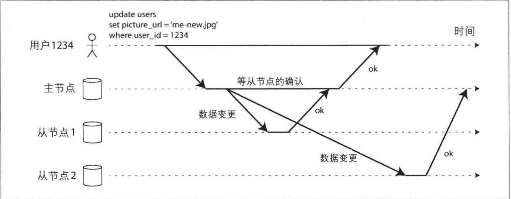
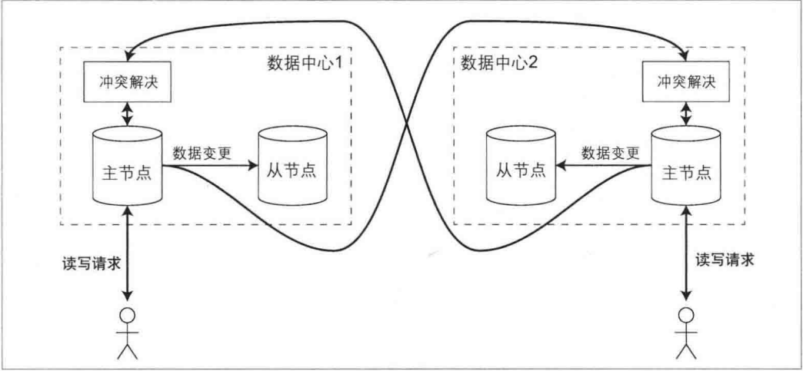
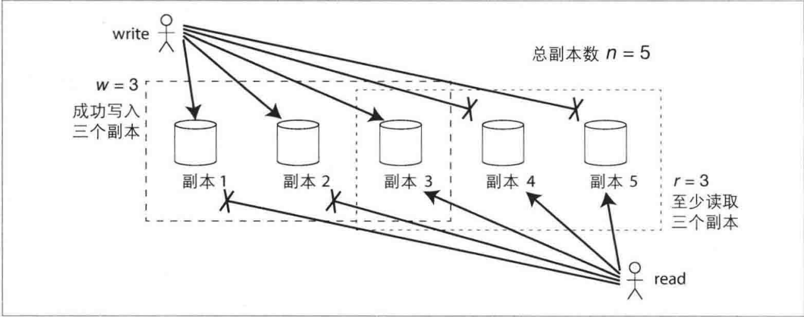

就[DDIA-分布式数据系统](./distribut.md)一文所提到的，出于高可用的目的，我们往往需要将数据复制到其他副本节点来提高容错。这里的复制主要指的是通过互联网在多台机器上保存相同的副本，并且可以带来如下好处：
1. 使数据在地理位置上更接近用户，从而降低访问延迟。
2. 当部分组件出现故障，系统依然可以继续工作，从而提高可用性。
3. 扩展至多台机器以同时提供数据访问服务，从而提高读吞吐量。

在分布式系统中，复制并不像单机系统中几字节的移动那么简单，由于网络的不稳定，单机节点的故障，很有可能带来整个分布式系统的不一致或者不可用。

接下来我们将探讨三种流行的复制数据方式：主从复制、多主复制和无主复制，对于每一种复制方式，可能也需要考虑是同步复制还是异步复制，如何处理失败副本等。

<!--more-->

## 主从复制

每个保存数据库完整数据集的节点称之为副本。那么在分布式系统中如何保证数据的一致性呢？

对于每一笔数据写入，所有副本都需要随之更新;否则，某些副本将出现不一致。最常见的解决方案是基于主节点的复制(也称为主动/被动，或主从复制),主从复制的工作原理如下:


1. 指定某一个副本为主副本 (或称为主节点) 。当客户写数据库时，必须将写请求首先发送给主副本，主副本首先将新数据写入本地存储。

2. 其他副本则全部称为从副本 (或称为从节点) 。主副本把新数据写入本地存储后，然后将数据更改作为复制的日志或更改流发送给所有从副本。每个从副本获得更改日志之后将其应用到本地，且严格保持与主副本相同的写和顺序。

3. 客户端从数据库中读数据时，可以在主副本或者从副本上执行查询。再次强调，只有主副本才可以接受写请求，从客户端的角度来看，从副本都是只读的。

### 同步复制与异步复制

现在有一个情景：网站用户需要更新首页的头像图片。



基于主从复制，首先，客户将更新请求发送给主节点，主节点接收到请求，之后将数据更新转发给从节点。最后，由主节点来通知客户更新完成。

在该示例中，从节点1是同步复制，因为主节点需要等到节点1的完成才会向用户报告完成，在这种模式下，如果用户读节点1,那么最新的更新是可见的。

对于从节点2是异步复制的，因为主节点不需要等待节点2完成写入，消息发送出去之后就之间返回了， 所以这种模式下，如果用户去读节点2,有可能会造成明明更新了数据，但是却依然是旧数据

既然异步复制可能会导致读到旧数据的现象出现，那直接使用同步复制不就好了吗？但是一个分布式系统中有成千上万个节点，如果由于网络不稳定，或者少量节点崩溃，那么写入就不能成功，主节点会堵塞之后的所以写操作，直至所有副本确定写入，这样保证了系统的一致性，但是却降低了可用性。

如果数据库启用了同步复制，通常意味着其中某一个从节点是同步的，而其他节点则是异步模式。万一同步的从节点变得不可用或性能下降，则将另一个异步的从节点提升为同步模式。这样可以保证
至少有两个节点 (即主节点和一个同步从节点) 拥有最新的数据副本。这种配置有时也称为半同步。

### 节点故障

#### 从节点恢复
当从节点因为本地故障或网络中断后重启，恢复过程较为直接。从节点在本地磁盘上保存的数据变更日志能够帮助确定故障发生前的最后一笔事务。从节点可以利用这些日志，重新连接到主节点并同步故障期间所有的数据变更，通过这种方式“追赶”主节点的最新状态。

#### 主节点恢复
主节点的失效处理更为复杂，关键步骤包括确认主节点失效、选举新的主节点，以及重新配置系统以使新主节点生效。
1. 确认主节点失效。有很多种出错可能性，例如由于系统崩溃，停电，网络问题等。大多数系统都采用了基于超时的机制: 节点间频繁地互相发生发送心跳存活消息来确认存活。
2. 选举新的主节点。可以通过选举的方式 (超过多数的节点达成共识) 来选举新的主节点，各种节点之间需要达到一致性共识。
3. 重新配置系统合新主节点生效。客户端现在需要将写请求发送给新的主节点，如果原主节点之后重新上线，可能仍然自认为是主节点。这时系统要将其降级为从节点。

然而，在上述过程中依然存在很多的变数：

1. 数据一致性和写冲突\
在异步复制场景中，如果主节点失效后，新提升的主节点未完全同步原主节点的数据，当原主节点快速恢复并重新加入集群时，可能导致数据冲突。新的主节点可能接收到与原主节点不一致的写请求，因为原主节点可能没有意识到已不再是主节点，继续尝试同步其他从节点。这种情况下，解决策略通常涉及放弃原主节点上未完成的写操作，但这可能违背数据持久性的承诺。

2. 脑裂（Split-Brain）问题\
脑裂是指两个节点同时认为自己是主节点的情况，这可能导致两个节点都接受写请求，而没有有效的冲突解决机制。这种情况下，数据可能会丢失或损坏。有些系统为了解决这一问题可能采取措施强制关闭其中一个节点，但如果设计或实现不当，可能导致两个节点都被关闭，进一步加剧问题。

3. 主节点失效检测和超时设置\
如何合理设置超时以检测主节点的失效是另一个挑战。超时设置过长，会延长系统的总体恢复时间；设置过短，则可能因为偶发的负载峰值、响应时间延长或网络延迟等因素导致不必要的节点切换。在高负载或网络拥塞的情况下，频繁的错误切换可能导致系统状态更加混乱。

对于上述的问题，包括节点失效、网络不可靠、副本一致性、持久性、可用性与延迟之间的权衡，正是分布式系统核心的基本问题，之后的1文章中，我们将进一步讨论。

### 复制日志的实现

#### 基于语句的复制
这种复制技术涉及将每个写请求（如INSERT、UPDATE、DELETE语句）直接转发给从节点进行执行。尽管这种方法初看简单，但在某些情况下不适用：
- 使用非确定性函数（如NOW()或RAND()）的语句可能在不同副本上产生不同结果。
- 自增列或依赖特定数据库状态的语句要求所有副本以相同顺序执行。
- 含有副作用（如触发器或存储过程）的语句可能在各副本上产生不同效果。

为解决这些问题，主节点可以在记录操作时用确定的结果替换非确定性函数的值。但由于存在许多边界条件，通常选择其他复制方案。

#### 基于预写日志(WAL)的复制
WAL复制涉及将写操作追加到日志中，然后通过网络将日志传输给从节点，从节点据此构建与主节点完全相同的数据副本。这种方式的复制与存储引擎紧密耦合，依赖于具体的存储格式，可能导致在不同版本的数据库软件间存在兼容性问题。

#### 基于行的逻辑日志复制
这种复制技术使用逻辑日志来描述行级别的数据变化，独立于存储引擎的物理数据表示。逻辑日志提供足够信息来标识和处理行的插入、删除和更新。这种方式易于与存储引擎逻辑解耦，增强了向后兼容性，并允许主从节点运行不同版本的软件。

WAL 记录具体的物理页变化，即具体哪些磁盘块被修改了，修改内容是什么。关注的是数据的物理层面(为方便于展示，简单的示例)
```WAL
LSN: 12345
Transaction ID: TX123
Page ID: Page 5
Offset: 135
Old Value: 'abc'
New Value: 'def'
```

逻辑日志记录高级的操作，而不是物理数据页的变化。如插入、删除和更新命令，包括操作涉及的表、行以及具体的列值。(为方便于展示，简单的示例)
```逻辑日志
Transaction ID: TX124
Operation: UPDATE
Table: Orders
Row Key: OrderID 1023
Changed Columns: Status
Old Value: 'Pending'
New Value: 'Completed'
```

#### 基于触发器的复制
这是一种更灵活的复制方法，涉及注册应用层代码以在数据变更时执行。这可以用于特定的数据同步场景，如部分数据复制或跨不同数据库类型的复制。尽管这种方法可能带来更高的开销和更多的错误风险，但其灵活性在某些应用场景中非常有价值。

### 复制滞后问题

#### 读自己写

应用中用户提交数据后，尝试读取时可能因为异步复制导致数据尚未同步到从节点，造成看似数据丢失的情况。


解决方案要求用户在提交数据后能立即看到自己的更新，这称为“写后读一致性”。

实现方法：

1. 主从节点读取策略：如果用户访问的是可能被自己修改的数据，应从主节点读取；如果访问的是不太可能修改的数据，则从从节点读取。
2. 时间戳和版本跟踪：通过在读取请求中包含更新的时间戳或版本信息，系统可以判断是否提供足够新的数据，如果数据不新，则需要等待或重定向至其他副本。
3. 复制延迟监控：监控从节点的复制进度，避免从滞后太多的从节点读取数据。

#### 单调读

在异步复制系统中，如果用户从不同副本读取数据，可能会遇到数据回滚的现象。这意味着用户可能先看到了最新的数据，然后再次刷新时看到了旧数据，造成混淆和不一致的用户体验。


单调读一致性是介于强一致性和最终一致性之间的一种数据一致性保证。它确保用户在连续读取操作中不会看到数据回滚现象，即用户不会在读取到较新的数据之后再看到旧数据。

实现方式：

1. 通过确保每个用户总是从固定的、同一副本读取数据来实现单调读一致性。这可以通过基于用户ID的哈希方法来选择副本，而非随机选择，从而减少从不同副本获取数据的不一致性。
2. 如果固定的副本发生故障，需要有策略将用户的读请求重新路由到其他副本，同时保持一致性保证。

#### 前缀一致读

在分布式系统中，因复制滞后而导致的数据更新顺序问题可能引起逻辑上的因果反常，如对话顺序颠倒的现象。这是分区数据库中的一个特殊现象，因为在众多分布式数据库中，不同的分区独立运行，因此不存在全局写入顺序，所以会看到顺序紊乱现象


前缀一致读保证在读取数据时，数据的展示顺序与其被写入的顺序相同，从而维护因果关系的一致性。

解决方案：

1. 对于包含因果关系的数据操作，尽量保持在同一分区内处理，以减少因分区独立操作导致的顺序问题。
2. 使用Happened-before关系的算法来显式地跟踪事件顺序，增强系统的一致性。

## 多主节点复制

多主节点复制（也称为主-主或主动/主动复制）允许多个主节点接受写操作，并将数据更改转发到所有其他节点。每个主节点同时扮演其他主节点的从节点角色。



适用场景：

1. 多数据中心：多主节点复制在跨多数据中心的环境中特别有用，可以在每个数据中心配置主节点，优化写入延迟，提高系统容错性和性能。
2. 离线客户端操作：如移动设备的应用程序，在离线状态下进行的更改稍后可与服务器和其他设备同步。

优势：

1. 性能：每个数据中心的写操作可以本地快速响应，通过异步复制同步到其他数据中心，减少网络延迟影响
2. 容灾：每个数据中心可以独立运行，故障的数据中心恢复后可更新到最新状态，提高系统的整体可用性。
3. 网络容忍性：异步复制可以更好地容忍网络问题，如临时的网络闪断。

挑战：

1. 写冲突：不同数据中心可能同时修改相同的数据，必须解决潜在的写冲突问题。
2. 系统复杂性：多主复制可能引入配置复杂性，与数据库的其他功能（如自增主键、触发器等）交互时可能出现意外的副作用。

所以对于多主节点复制，最核心的问题就是面临的写冲突

### 处理写冲突

例如，两个用户同时编辑wiki页面，用户1将页面的标题从A更改为
B，与此同时用户2却将标题从A改为C。每个用户的更改都顺利地提交到本地主节点。 但是，当更改被异步复制到对方时，却发现存在冲突后。


处理冲突的最理想的方式是避免发送冲突，如果引用层可以保证对特定记录的写请求总是通过一个主节点，那么就不会发生冲突，但是如果该数据中心发生故障，不得已将流量重新路由到新的数据中心，那么必须采用对应的措施来避免写入冲突

在主从复制模型中，数据更新遵循顺序性原则，即后来的写操作确定最终值。然而多主节点复制模型由于没有固定的写入顺序，最终的数据值可能不确定，所以需要通过收敛于一致状态的机制来解决冲突

收敛于一致状态解决机制：
1. 最后写入者获胜：基于时间戳或其他唯一标识，选择最后的写入作为有效更新。
2. 唯一副本ID优先：基于副本的序号，高序号副本的写入优先。(这种方式也会导致数据丢失)
3. 合并：将冲突的值按某种规则合并。
4. 记录和保留冲突信息：利用应用层逻辑在后期解决冲突，如用户提示解决冲突。

## 无主节点复制

到目前为止本章所讨论的复制方法，包括单主节点和多主节点复制，都是基于这样一种核心思路 : 即客户端先向某个节点(主节点) 发送写请求，然后数据库系统负责将写请求复制到其他副本。由主节点决定写操作的顺序，从节点按照相同的顺序来应用主节点所发送的写日志。

一些数据存储系统则采用了不同的设计思路: 选择放弃主节点，允许任何副本直接接受来自客户端的写请求。

早期的数据复制系统采用无主节点模式，也称为去中心化或无中心复制。在无主节点系统中，客户端可以直接向任何副本发送写请求，无需经过主节点。某些系统中存在协调者节点负责写操作的协调，但不维护写入顺序。


用户1234将写请求并行发送到三个副本，有两个可用副本接受写请求，而不可用的副本无法处理该写请求。如果假定三个副本中有两个成功确认写操作，用户1234收到两个确认的回复之后，即可认为写入成功。客户完全可以忽略其中一个副本无法写入的情况。

### 读写 quorum

通过这个例子，三个副本中如果有两个以上完成处理，则认为写入成功，那么以此类推，究竟多少个副本完成才可以认为写入成功？

我们知道，成功的写操作要求三个副本中至少两个完成，这意味着至多有一个副本可能包含旧值。因此，在读取时需要至少向两个副本发起读请求，这样至少有一个节点包含新值。如果第三个副本出现停机或响应缓慢，则读取仍可以继续并返回最新值。

把上述道理推广到一般情况，如果有n个副本，写入需要w个节点确认，读取必须至少查询r个节点，则只要 `w + r > m`，读取的节点中一定会包含最新值。例如在前面的例子中 n = 3，w = 2，r = 2。满足上述这些 r 、w 值的读/写操作称之为法定票数读 (仲裁读) 或法定票数写 (仲裁写)。



## 小结

本章，我们详细探讨了复制相关的话题。复制或者多副本技术主要服务于以下目的:

1. 高可用性: 即使某台机器(或多台机器，或整个数据中心) 出现故障，系统也能保持正常运行。
2. 连接断开与容错: 允许应用程序在出现网络中断时继续工作。
3. 低延迟: 将数据放置在距离用户较近的地方，从而实现更快地交互。
4. 可扩展性: 采用多副本读取，大幅提高系统读操作的吞吐量。

我们主要讨论了三种多副本方案:
1. 主从复制\
   所有的客户端写入操作都发送到某一个节点(主节点) ，由该节点负责将数据更改事件发送到其他副本(从节点) 。每个副本都可以接收读请求，但内容可能是过期值。
2. 多主节点复制\
   系统存在多个主节点，每个都可以接收写请求，客户端将写请求发送到其中的一个主节点上，由该主节点负责将数据更改事件同步到其他主节点和自己的从节点。
3. 无主节点复制\
   客户端将写请求发送到多个节点上，读取时从多个节点上并行读取，以此检测和纠正某些过期数据。

每种方法都有其优点和缺点。主从复制非常流行，主要是因为它很容易理解，也不需要担心冲突问题。而万一出现节点失效、网络中断或者延迟抖动等情况，多主节点和无主节点复制方案会更加可靠，不过背后的代价则是系统的复杂性和弱一致性保证。

复制可以是同步的，也可以是异步的，而一旦发生故障，二者的表现差异会对系统行为产生深远的影响。在系统稳定状态下异步复制性能优秀，但仍需考虑一旦出现复制滞后和节点失效两种场景会导致何种影响。

我们还分析了由于复制滞后所引起的一些奇怪效应，并讨论了以下一致性模型，来帮助应用程序处理复制滞后：
1. 写后读一致性\
   保证用户总能看到自己所提交的最新数据。
2. 单调读\
   用户在某个时间点读到数据之后，保证此后不会出现比该时间点更早的数据。
3. 前缀一致读\
   保证数据之间的因果关系，例如，总是以正确的顺序先读取问题 ，然后看到回答


