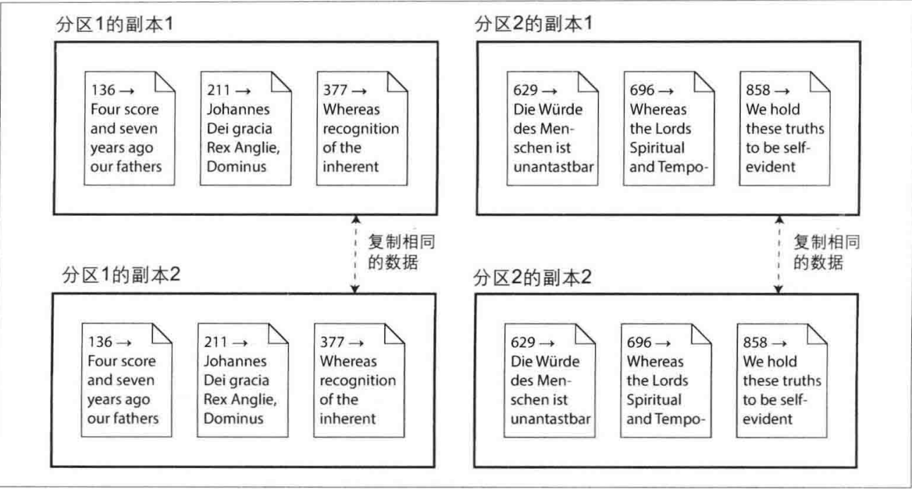

前面几篇文章主要讨论了单台机器存储系统设计的主要技术。后面我们将继续向前迈进，当需要多台机器提供数据存储和检索服务时，又会有哪些挑战和方案呢?

主要出于以下目的，我们需要在多台机器上分布数据：

1.  扩展性\
    当数据量或者读写负载巨大，严重超出了单台机器的处理上限，需要将负载分散到多台机器上。

2. 容错与高可用性\
    当单台机器 (或者多台，以及网络甚至整个数据中心) 出现故障，还希望应用系统可以继续工作，这时需要采用多台机器提供冗余。这样某些组件失效之后，其他组件可以迅速接管。

3.  延迟考虑\
    如果客户遍布世界各地，通常需要考虑在全球范围内部署服务，以方便用户就近访问最近数据中心所提供的服务，从而避免数据请求跨越了半个地球才能到达目标。

## 系统扩展能力

当负载增加需要更强的处理能力时，最简单的办法就是购买更强大的机器 (有时称为垂直扩展) 。由一个操作系统管理更多的CPU，内存和磁盘，通过高速内部总线使每个CPU都可以访问所有的存储器或磁盘。

这种`共享内存架构`的问题在于，成本增长过快甚至超过了线性: 即如果把一台机器内的CPU数量增加一倍，内存扩容一倍，磁盘容量加大一倍，则最终总成本增加不止一倍。并且由于性能瓶颈因素，这样一台机器尽管拥有了两倍的硬件指标但却不一定能处理两倍的负载。

共享内存架构能够提供有限的容错能力，例如高端的服务器可以热插拔很多组件 (在不关闭机器的情况下更换磁盘，内存模块，甚至是CPU) 。但很显然，它仍局限于某个特定的地理位置，无法提供异地容错能力。

另一种方法是共享磁盘架构，它拥有多台服务器，每个服务器各自拥有独立的CPU和内存，然后将数据存储在可共享访问的磁盘阵列上，服务器与磁盘阵列之间往往通过高速网络连接。这种架构多适用于数据仓库等负载，然而通常由于资源竞争以及锁的开销等限制了其进一步的扩展能力。

## 无共享结构
相比之下，无共享架构(也称为水平扩展)则获得了很大的关注度。当采用这种架构时，运行数据库软件的机器或者虚拟机称为节点。每个节点独立使用本地的CPU，内存和磁盘。节点之间的所有协调通信等任务全部运行在传统网络 (以太网) 之上且核心允辑主要依靠软件来实现。

无共享系统不需要专门的硬件，且有较高的性价比。它可以跨多个地理区域分发数据，从而减少用户的访问延迟，甚至当整个数据中心发生灾难时仍能继续工作。通过云计算虚拟机的部署方式，即便是没有Google级别规模的小公司，也可以轻松拥有跨区域的分布式架构和服务能力。

后面几篇文章的内容将重点放在无共享体系架构上，例如把数据分布在多节点上，就需要了解在这样一个分布式系统下，背后的权衡设计和隐仿限制，数据库并不能魔法般地把所有复杂性都屏蔽起来。

## 复制与分区

将数据分布在多节点时有两种常见的方式，后面我们将分别探究这两种不同技术的应用。

1.  复制\ 
    在多个节点上保存相同数据的副本，每个副本具体的存储位置可能不尽相同。当某些节点发生不可用时，则可以通过其他节点继续提供数据访问服务。复制也可以帮助提高系统性能。
2.  分区\
    将一个的数据库拆分成多个较小的子集即分区，不同的分区分配给不同的节点(也称为分片) 。

这些是不同的数据分布机制，然而它们经常被放在一起组合使用。

