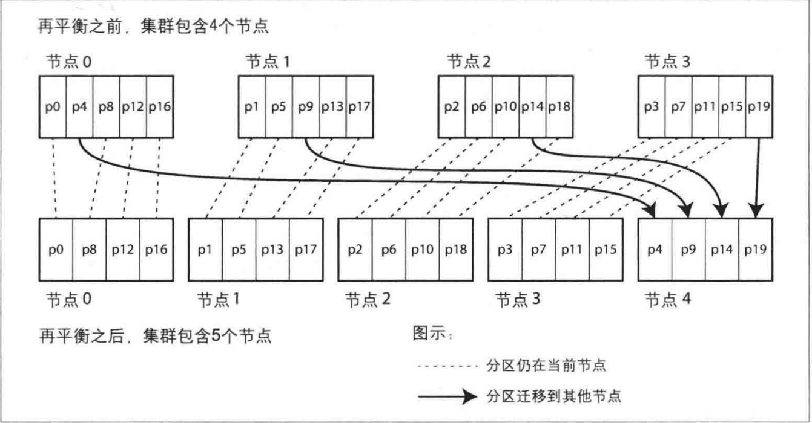

当面对一些海量数据集或非常高的查询压力时，我们可以通过 [数据复制复制](./copy.md)，即在不同节点上保存相同数据的多个副本，然而有时还是不够，我们还需要将数据拆分为分区，也成为分片。

采用数据分区的主要目的是提高可扩展性。不同的分区可以放在一个无共享集群的不同节点上。这样一个大数据集可以分散在更多的磁盘上，查询负载也随之分布到更多的处理器上。

对单个分区进行查询时，每个节点对自己所在分区可以独立执行查询操作，因此添加更多的节点可以提高查询吞吐量。超大而复杂的查询尽管比较困难，但也可能做到跨节点的并行处理。

<!--more-->

## 数据分区与数据复制

分区通常与复制结合使用，即每个分区在多个节点都存有副本。这意味着某条记录属于特定的分区，而同样的内容会保存在不同的节点上以提高系统的容错性。

既然是切分，那么首要的目的是如何切分数据，即如何决定那些记录应该放在哪些节点上？

分区的首要目标是将数据和查询负载均匀的分布在所有节点上，因为如果分区不均匀，出现某些分区节点比其他分区承担更多的数据量与负载。这意味着10个节点9个空闲，那么最繁忙的那个将会成为系统的瓶颈。

如果随机平均分配在所有节点上，那么当读取特定数据时，便没法知道数据保存在哪一种节点上，这样不得不并行查询所有节点。

接下来我们将通过几种常见的方式来对数据进行分区：

## 键值分区

### 基于关键字区间分区

这种方式通过为每个分区分配一个关键字区间（通常由最小值和最大值界定）来组织数据，类似于图书馆中的百科全书卷目录。通过知道关键字的区间，可以直接定位到包含这些关键字的分区，进而向相应的节点发出请求。

此外，关键字的区间不必均匀分布，因为数据本身可能分布不均。例如，有的卷可能包含以多个字母开头的单词，而有的卷则只包含以一两个字母开头的单词。为了更均匀地分布数据，可以根据数据的实际分布来调整分区边界。这种分区策略可以手动设置，也可以由数据库系统自动选择。

每个分区内的数据可以按关键字排序存储，以支持区间查询，这对于需要执行时间范围查询的应用尤其有用。

然而，基于关键字的区间分区缺点是某些访问模式会导致热点，例如基于时间戳的分区，因为所有写入操作可能集中在当前的时间分区上。导致该分区写入时负载过高。为了避免这一问题，可以将时间戳以外的元素（如传感器名称）作为关键字的首部，以此实现负载的均匀分布。

### 基于关键字哈希值分区

基于关键字哈希值的数据分区方法也是一种常见的方式，选用适当的哈希函数，如32位处理字符串的哈希函数，可以使得即使输入的字符串非常相似，其返回的哈希值也能在一个预定范围内（如0到2^32-1）近似随机地分布，从而有效处理数据倾斜并实现数据的均匀分布。

在数据分区中，不是直接按关键字的字面范围来分区，而是将数据根据关键字的哈希值划分到不同的分区。例如，可以为每个分区分配一个哈希值范围，关键字则根据其哈希值落入相应的分区。

然而，基于哈希的分区策略虽然可以有效避免热点并均匀分布数据，但它对于区间查询的支持较差。关键字经过哈希处理后可能被分配到多个不同的分区，使得连续的关键字不再物理上相邻，这导致区间查询变得复杂和低效。

尽管一致性哈希在理论上是平衡负载的良好方法，但在数据库应用中的实际效果并不总是理想的，导致某些数据库系统采用了修改或不完全遵循一致性哈希的策略。如Cassandra，它允许表的复合主键中第一部分用于哈希分区，而其余部分则用于排序，从而允许在固定第一列的情况下对其他列进行高效的区间查询。这种策略为数据提供了既均匀分布又支持有效查询的平衡方式。

## 二级索引分区

上述两种方案依赖于键-值数据模型，都是通过关键字来访问数据，通过关键字来确定分区，并将读写请求路由到该关键字的分区上。

但二级索引并不能唯一标识记录，一个索引可能对应多个值，那么情况就会复杂很多，有两种主要的方式来支持对二级索引进行分区：基于文档的分区和基于词条的分区

### 基于文档分区的二级索引

假设一个销售二手车的网站。每个列表都有一个唯一的文档ID ，用此ID对数据库进行分区，例如，ID 0到499归分区0，ID 500到999划为分区1。

现在用户需要搜索汽车，可以按汽车颜色和厂商进行过滤，所以需要在颜色和制造商上设定二级索引 (在文档数据库中这些都是字段，在关系数据库中则是列) 。声明这些索引之后，数据库会自动创建索引。例如，每当一辆红色汽车添加到数据库中，数据库分区会自动将其添加到索引条目为 “color:red” 的文档ID列表中。

每个分区独立维护自己的索引并只处理自己分区内的文档。这种索引被称为本地索引。然而，在执行查询时，特定的属性如颜色或品牌可能跨越多个分区，例如搜索红色汽车可能需要查询所有分区并合并结果。这种方法虽然实现简单，但查询代价较高，可能导致读延迟增加。

### 基于词条的二级索引分区

另一种方法，我们可以对所有的数据构建全局索引，而不是每个分区维护自己的本地索引。而且，为避免成为瓶颈，不能将全局索引存储在一个节点上，否则就破坏了设计分区均衡的目标。所以，全局索引也必须进行分区，且可以与数据关键字采用不同的分区策略。

全局索引的一个主要优点是读取效率高。不需要对所有分区执行查询，客户端只需向包含特定词条的分区发出读请求。

然而，全局索引的写入操作复杂且速度较慢，特别是当单个文档更新涉及多个二级索引时，因为这些索引分区可能位于不同的节点上，这导致写放大现象。此外，全局索引更新通常是异步的，这意味着在写入后立即读取索引可能不会看到最新的更新。

## 分区再平衡

随着时间的推移，数据库可能总会出现某些变化:
1. 查询压力增加，因此需要更多的CPU来处理负载。
2. 数据规模增加，因此需要更多的磁盘和内存来存储数据。
3. 节点可能出现故障，因此需要其他机器来接管失效的节点。

所有这些变化都要求数据和请求可以从一个节点转移到另一个节点。这样一个迁移负载的过程称为再平衡 (或者动态平衡) 。无论对于哪种分区方案，分区再平衡通常至少要满足:

1. 平衡之后，负载、数据存储、读写请求等应该在集群范围更均匀地分布。
2. 再平衡执行过程中，数据库应该可以继续正常提供读写服务。
3. 避免不必要的负载迁移，以加快动态再平衡，并尽量减少网络和磁盘I1O影响。

### 固定数量的分区

能否使用模运算 (mod) 来将哈希值分配给节点？答案是不行的，使用mod的问题在于，节点数的变动会导致大量关键字需要迁移，增加再平衡的成本。

为了减少这种成本，可以使用固定数量的分区，创建远超节点数的分区，然后将分区均匀分配给各个节点。这种方法可以在增加或减少节点时，通过重新分配部分分区来实现再平衡，而不需要改变关键字到分区的映射关系，从而减少了数据迁移的复杂度和成本。

### 动态分区

如果数据集的总规模高度不确定，此时如何确定分区的上限就变得很困难，很有可能造成空间的浪费或者空间的不足

动态分区的策略在分区数据量超过设定阈值时自动拆分分区，并在数据量减少到某一阈值以下时与相邻分区合并。当分区的数据增长超过一个可配的参数阈值时，它就拆分为两个分区，每个承担一半的数据量。相反，如果大量数据被删除，并且分区缩小到某个阈值以下，则将其与相邻分区进行合并。(该过程类似于B树的分裂操作)

### 按节点比例分区

将分区数与节点数挂钩，使得每个节点维持固定数量的分区，从而当节点数增加时，可以通过分裂现有分区来适应。

## 请求路由

通过上述的方式，数据集分布到多个节点上，但是当客户端需要发送请求时，如何知道应该连接到哪一个节点？如果发生了分区再平衡，分区与节点的对应关系还会发生变化？这其实属于一类典型的服务发现问题

概况来讲，有以下几种不同的处理策略：

1. 任意节点连接：客户端可以连接到任何节点。如果连接的节点拥有请求的分区，则直接处理请求；如果没有，请求将被转发到正确的节点。

2. 集中路由层：所有客户端的请求首先发送到一个路由层，这个层次不处理请求，只负责将请求根据分区信息转发到正确的节点。

3. 客户端分区感知：客户端直接了解分区与节点的映射关系，可以直接连接到数据所在的节点，无需中介。

许多分布式数据系统依靠独立的协调服务 (如ZooKeeper) 跟踪集群范围内的元数据，每个节点都向ZooKeeper中注册自己，ZooKeeper维护了分区到节点的最终映射关系。其他参与者(如路由层或分区感知的客户端) 可以向ZooKeeper订阅此信息。一旦分区发生了改变，或者添加、删除节点，ZooKeeper就会主动通知路由层，这样使路由信息保持最新状态。

## 小结

本章，我们探讨了将大规模数据集划分成更小子集的多种方法。数据量如果太大，单台机器进行存储和处理就会成为瓶颈，因此需要引入数据分区机制。分区的目地是通过多台机器均匀分布数据和查询负载，避免出现热点。

我们讨论了两种主要的分区方法:

1. 基于关键字区间的分区。先对关键字进行排序，每个分区只负责一段包含最小到最大关键字范围的一段关键字。对关键字排序的优点是可以支持高效的区间查询，但是如果应用程序经常访问与排序一致的基段关键字，就会存在热点的风险。采用这种方法，当分区太大时，通常将其分裂为两个子区间，从而动态地再平衡分区。

2. 哈希分区。将哈希函数作用于每个关键字，每个分区负责一定范围的哈希值。这种方法打破了原关键字的顺序关系，它的区间查询效率比较低，但可以更均匀地分配负载。采用哈希分区时，通常事先创建好足够多 (但固定数量) 的分区，让每个节点承担多个分区，当添加或删除节点时将某些分区从一个节点迁移到另一个节点，也可以支持动态分区。

混合上述两种基本方法也是可行的，例如使用复合键: 键的一部分来标识分区 ，而另一部分来记录排序后的顺序。

我们还讨论了分区与二级索引，二级索引也需要进行分区，有两种方法:

1. 基于文档来分区二级索引 (本地索引) 。二级索引存储在与关键字相同的分区中，这意味着写入时我们只需要更新一个分区，但缺点是读取二级索引时需要在所有分区上执行scatter/gather。

2. 基于词条来分区二级索引 (全局索引) 。它是基于索引的值而进行的独立分区。二级索引中的条目可能包含来自关键字的多个分区里的记录。在写入时，不得不更新二级索引的多个分区， 但读取时，则可以从单个分区直接快速提取数据。