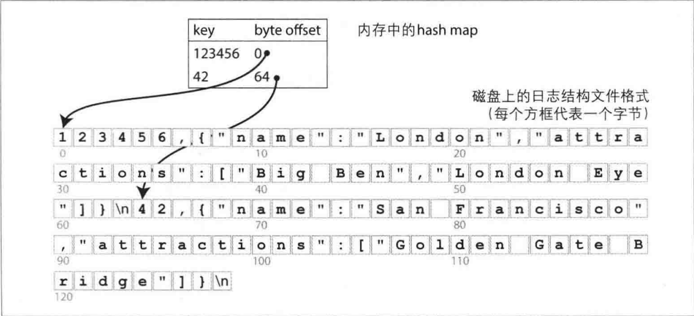
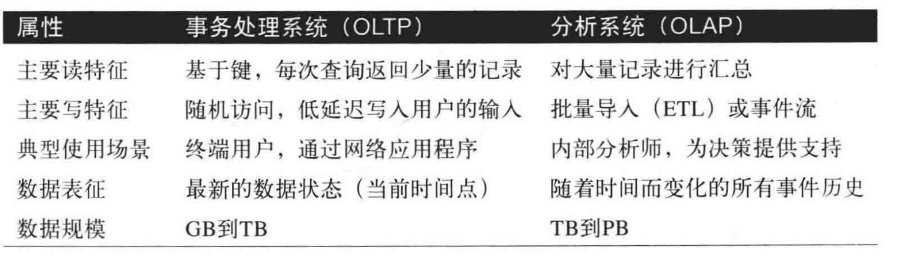
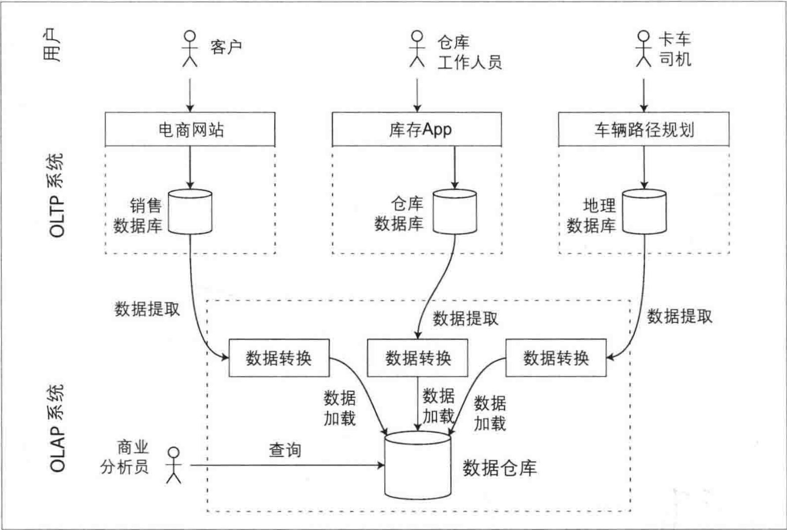
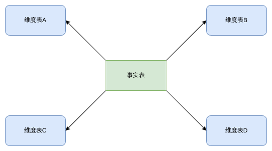
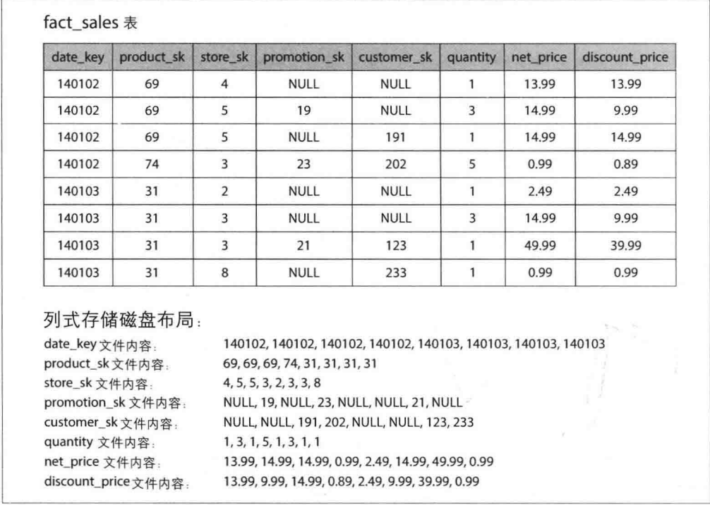

对于数据库来说，向它插入数据，它就保存数据，向它查询，它就返回那些数据，根据上文，当确定数据库的数据格式(文档模型，关系模型，图状模型)以及对应的查询语言(SQL、命令式查询)之后，本文将从数据库的角度来探索如何存入数据以及在受到查询时，如何找到数据。

<!--more-->

## 数据库核心

```sh
#!/bin/bash

db_set () {
    echo "$1,$2" >> database
}

db_get () {
    grep "^$1," database | sed -e "s/^$1,//" | tail -n 1
}
```

这两个函数实现了一个 KV 存储，当调用 db_set key value,将在 database 中保存 key value, 调用 db_get key ,会返回 key 对应的 value

它底层的存储格式其实非常简单 : 一个纯文本文件。其中每行包含一个key-value对，用逗号分隔 (大致像一个CSV文件，忽略转义问题) 。每次调用db_set即追加新内容到文件未尾，因此，如果多次更新某个键，旧版本的值不会被覆盖 ，而是需要查看文件中最后一次出现的键来找到最新的值 (因此在db_get中使用tail -n 1) 。

但是一旦该文件保存了大量的数据，查找性能将会非常的差，当文件损坏的时候，很难进行恢复，无法支持并发控制，处理错误等

## 哈希索引

对于上面所示数据库的不足，我们一一来解决，首先是查找性能。

对于数组，我们知道数组下标可以充当索引，当得知该元素的下标时，就可以直接访问该元素。同样的道理，只不过这里元素之间的距离不一定是定长，所以可以记录该元素的偏移量来充当索引



这上听起来可能过于简单，但它的确是一个可行的方法。事实上，这就是 Bitcask 所采用的核心做法。Biteask可以提供高性能的读和写，只要所有的key可以放入内存 (因为hash map需要保存在内存中) 。而value数据量则可以超过内存大小，只需一次磁盘寻址，就可以将value从磁盘加载到内存。如果那部分数据文件已经在文件系统的缓存中，则读取根本不需要任何的磁盘I/O。

但是此时又生产了一个新的问题，当文件过大怎么办？因为只追加到一个文件，时间长了，数据量必定很大，一个好的解决方式是：将文件分为段，当文件到达一定大小的时候就关闭它

这样可以对文件进行压缩，因为所有数据都以追加的形式插入文件，势必会造成，同一个key既对应着老数据，又对应着新数据


同样也可以对文件进行合并，因为不同段之间可能存在相同的key


这种 key value 索引的方式,可以在一定程度上提升读写性能，但是依然存在以下的问题：
1. 这种以文件存储的方式不是最佳的存储格式，所有字符都转移为 ASCII 编码，更快简单的方式是使用二进制格式
2. 当数据库崩溃时，内存中的数据将会丢失，并且数据恢复时，需要从头到尾扫描整个文件，开销不小
3. 区间查询效率并不高，例如扫描 tinysky0000 到 tinysky9999 区间的key,只能逐个哈希去查找。

## SSTables 和 LSM-Tree

首先是区间查询效率

上面的文件结构是一组 key-vaklue 序列，且后值优于前值，在此基础上如果要求 key-value 对按 key 排序，那么临近的 key 将会在一起(如：tinysky0000 - tinysky9999)，将会大大提升区间查询效率，而这种格式称为排序字符串表，或简称为 SSTable


带来的好处还不止如此，因为文件结构采用分段的形式，每一个段内都是有序的，那么该段最小的一个 key 一定是第一个，那么在合并段时，将会大大提升效率


想法很好，但是用户可能以任意顺序输入key value,所以在内存中需要一个过渡的数据结构(红黑树，AVL树，跳表)来对用户输入进行排序，当数据量到达一定的规模时，将数据顺序写入到 SSTable 中。

完整流程如下：
1. 当用户写入时，将其添加到内存中的平衡树数据结构中(例如跳表) 。这个内存中的树有时被称为内存表(Memtable)。

2. 当内存表大于某个值 (通常为几兆字节) 时，将其作为SSTable文件写入磁盘。由于树已经维护了按键排序的key-value对，写磁盘可以比较高效。

3. 为了处理读请求，首先尝试在内存表中查找键，然后是最新的磁盘段文件，接下来是次新的磁盘段文件，以此类推，直到找到目标 (或为空)

4. 后台进程周期性地执行段合并与压缩过程，以合并多个段文件，并丢弃那些已被覆盖或删除的值。

上述方案可以很好地工作。但它还存在一个问题: 如果数据库崩溃，最近写入(在内存表中但尚未写入磁盘) 将会丢失。为了避免该问题，可以在磁盘上保留单独的日志，每个写入都会先追加到该日志，就像上一节所述。那个日志文件不需要按键排序，因为它的唯一目的是在崩溃后恢复内存表。每当将内存表写入SSTable时，相应的日志可以被丢弃。(这种技术称为WAL)

上述算法的本质正是 LevelDB 和 RocksDB 所使用的，主要用于嵌入其他应用程序的 key-value 中，最初这个索引结构以日志结构的合并树(Log Structured Merge Tree,或LSM-Tree)命名,它建立在更早前的日志结构文件系统之上，因此，基于合并和压缩文件原理的存储结构通常称为LSM存储引擎

## B-trees

上述讨论的属于日志结构索引，但是目前最为广泛使用的是另一种

像 SSTable 一样，B-tree也保留这按键排序的 KV 对，可以高效实现key-value查找与区间查询，但本质上却是截然不同的设计理念

日志结构索引将数据分为段，并按顺序写入段，相比之下，B-tree将数据分为页，传统为4KB(有时更大),页是内部读/写的最小单元。因为磁盘也是以固定大小的块排列。


某一页被指定为B-tree的根，每当查找索引中的一个键时，总是从这里开始。该页面包含若干个键和对子页的引用。每个孩子都负责一个连续范围内的键。

与日志结构索引相比，B-tree底层的写操作是直接使用新数据覆盖原本磁盘上的旧数据，而前者则是仅追加更新文件，并不是直接在原本数据处修改，所以为了 B-tree 可以在崩溃中恢复，常见的做法是引入额外的数据结构：预写日志(write-ahead log,WAL),也成为重做日志，每一个B-tree的修改必须先更新WAL然后再修改树本身的页

## 其他索引结构

1. 主键索引：主键索引唯一标识数据库中的一行、一个文档或一个顶点，并用于解析对这些数据的引用。

2. 二级索引：二级索引可以基于key-value索引构建，但它的键不是唯一的。这些索引对执行联结操作非常重要，并可以以列表的形式存储多个行标识符，或通过追加行标识符来使键唯一。

3. 多列索引：多列索引将多个字段组合成一个键，适用于需要同时查询多个字段的情况。它可以优化特定字段组合的查询，但可能无法高效处理单独查询其中一个字段的情况。

4. 全文搜索与模糊索引：全文搜索索引支持对文本进行更复杂的查询，如同义词搜索、拼写错误处理等。模糊索引允许对近似值进行搜索，适用于处理拼写错误等情况。

对于上面的索引方式，如果在索引中直接保存行数据，则称之为聚集索引，若索引仅存储对数据行的引用则称之为非聚集索引，这两者之间存在一种折中的方式称为覆盖索引，它在索引中保存了一些表的列值，它可以只通过索引即回答某些简单的查询。

## 事务处理与分析处理

在商业数据处理的早期阶段，写入数据库通常对应于商业交易场景，例如销售、订单、支付员工工资等。尽管后来数据库扩展到了不涉及金钱交易的领域，事务一词仍然存在，主要指组成一个逻辑单元的一组读写操作。

尽管数据库开始被用于许多不同种类的数据，但是其基本访问模式仍然与处理业务交易类似。根据用户的输入插入或更新记录，因为这些应用程序是交互式的，所以访问模式被称为`在线事务处理`(online transaction processing,OLTP)

当然，数据库也越来越用于数据分析，通过大量的数据来统计数据(计数，求和，平均值),这种模式称之为`在线分析处理`(online analytic processing, OLAP)



最初，相同的数据库可以同时用于事务处理和分析查询。SQL可以同时胜任OLTP类型和OLAP类型查询。后来很多公司放弃使用OLTP系统用于分析目的，而是在单独的数据库上运行分析。这个单独的数据库被称为`数据仓库`。

## 数据仓库

由于 OLTP 系统是为高效处理日常事务（如销售、订单处理等）设计的，这些系统必须保持高可用性和低延迟。如果在OLTP数据库上直接进行临时分析查询，而这种查询往往代价很高，需要扫描大量的数据，可能会损坏并发执行事务的性能。


相比之下，数据仓库则是单独的数据库，分析人员可以在不影响OLTP操作的情况下尽情地使用。数据仓库包含公司所有各种OLTP系统的只读副本。从OLTP数据库(使用周期性数据转储或连续更新流) 中提取数据，转换为分析友好的模式，执行必要的清理，然后加载到数据仓库中。将数据导入数据仓库的过程称为`提取-转换-加载`
(Extract-Transform-Load，ETL)



使用单独的数据仓库而不是直接查询OLTP系统进行分析，很大的优势在于数据仓库可以针对分析访问模式进行优化。事实证明，本章前半部分讨论的索引算法适合OLTP，但不擅长应对分析查询。

在下文中，将重点讨论针对分析型而优化的存储引擎。

### OLAP数据库和数据仓库之间的差异

数据仓库的数据模型最常见的是关系型，因为SQL通常适合分析查询。

#### 数据模型

在数据仓库的建设过程中，根据事实表与维表的关系，经常将数据模型分为星型模型、雪花模型及星座模型

1. 星型模型\
    星型模型中只有一张事实表，以及0张或多张维表，事实表与维表通过主键外键相关联，维表之间不存在关联关系，当所有维表都关联到事实表时，整个图形非常像一种星星的结构，所以称之为“星型模型”。



对应的关系表


通常这种方式的分析具有很大的灵活性，但是这意味着事实表可能会变得非常庞大。像苹果或者这样的大企业，其数据仓库可能有数十PB的交易历史，其中大部分都保存在事实表中。

2. 雪花模型\
    当一个或多个维表没有直接连接到事实表上，而是通过其他维表连接到事实表上时，其图解就像多个雪花连接在一起，故称雪花模型。雪花模型是对星型模型的扩展。


#### 列式存储

如果事实表中有着数以万行的数据，则高效的存储将成为一个具有挑战性的问题，但是如果一次查询只访问其中的4个或5个字段，则查询性能将会受到很大的影响

面向列存储的想法很简单，将每列中的所有值存储在一起。如果每个列存储在一个单独的文件中，查询只需要读取和解析在该查询中使用的那些列。



同时面向列存储的方式非常适合压缩，如上图，他们看起来有很多重复的数据或前缀，在数据仓库中，特别有效的一种技术是位图编码

虽然列存储优化了读操作，但它可能使写入操作更为复杂，特别是在需要插入或更新数据时。

#### 聚合：数据立方体与物化视图

物化视图：
1. 物化视图是在关系数据库中预先计算并存储的查询结果，不同于虚拟视图，物化视图将数据实际写入磁盘。
2. 它提供了一种缓存机制，使得重复的查询可以直接访问预计算的结果，从而提高查询效率，尤其是对于重复使用相同聚合（如COUNT、SUM、AVG、MIN或MAX）的查询。
3. 物化视图需要在底层数据更新时同步更新，这可能影响写入性能，因此在写密集型的OLTP系统中使用较少。

数据立方体或OLAP立方体：
1. 数据立方体是物化视图的一种特殊形式，它按多个维度（如日期和产品）组织数据，使得可以快速聚合和分析跨多个维度的数据。
2. 在数据立方体中，数据按照特定的属性（如日期和产品）预聚合，每个维度可以沿着其轴进行进一步的聚合分析。

## 小结
本文我们简单介绍了数据库内部如何处理存储与检索。

概括来讲，存储引擎分为两大类: 针对事务处理 (OLTP) 优化的架构，以及针对分析型 (OLAP) 的优化架构。
- OLTP系统通常面向用户，这意味着它们可能收到大量的交互式请求。为了处理负载，应用程序通常在每个查询中只涉及少量的记录。应用程序基于某种键来请求记录，而存储引擎使用索引来查找所请求键的数据。磁盘寻道时间往往是瓶颈。
- 由于不是直接面对最终用户，数据仓库和类似的分析型系统相对并不大广为人知，它们主要由业务分析师使用。处理的查询请求数目远低于OLTP系统，但每个查询通常要求非常苛刻，需要在短时间内扫描数百万条记录。磁盘带宽 (不是寻道时间) 通常是瓶颈，而面向列的存储对于这种工作负载成为日益流行的解决方案。

在OLTP方面，由两个主要流派的存储引擎：

- 日志结构流派，它只允许追加式更新文件和删除过时的文件，但不会修改已写人的文件。BitCask、SSTables、LSM-tree、LevelDB 、Cassandra、HBase、Lucene等属于此类。
- 原地更新流派，将磁盘视为可以覆盖的一组固定大小的页。B-tree是这一哲学的最典型代表，它已用于所有主要的关系数据库，以及大量的非关系数据库。

日志结构的存储引擎是一个相对较新的方案。其关键思想是系统地将磁盘上随机访间写入转为顺序写人，由于硬盘驱动器和SSD的性能特性，可以实现更高的写入吞吐量。

此外，简要介绍了一些更复杂的索引结构，以及为全内存而优化的数据库。

然后，从存储引擎间接地探索了典型数据仓库的总体架构。由此说明为什么分析工作负载与OLTP如此不同: 当查询需要在大量行中顺序扫描时，索引的关联性就会显著降低。相反，最重要的是编码数据，以尽量减少磁盘读取的数据量。我们讨论了列存储如何帮助实现这一目标。