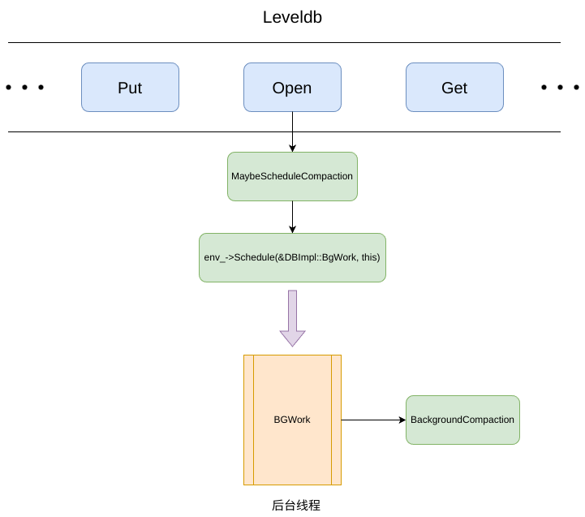
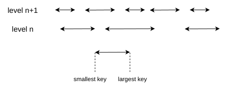
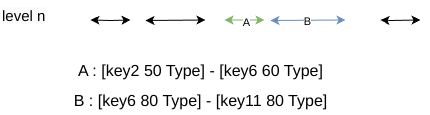
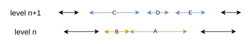
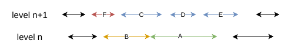

## 背景

leveldb 是一个写效率十分高的存储引擎, 一次写操作只需要顺序写日志(WAL)，内存跳表插入(logn)

但是如此以来读性能就有所下降，在最差的情况下可能需要查找以下所有文件
```
MemTable --> Immutable MemTable --> Level 0 files --> Level 1 files -->Level 2 files ......-->Level 6 files
```
所以引入 Compaction 可以带来如下好处
- 平衡读写差异，将相关文件进行合并
- 删除过时数据，减少数据量

<!--more-->

## 分析

Compaction 是通过后台线程调用 BackgroundCompaction 来触发，上一章中我们分析了如何触发 Compaction 并分析了当中的 [Minor Compaction](./TableBuilder.md) ，本文将关注当中的 Major Compaction (SSTable 当中的 Compaction)



[BackgroundCompaction](https://github.com/tiny-sky/leveldb/blob/main/db/db_impl.cc#L702) 主要有两个部分组成

#### Minor Compaction
```cpp
if (imm_ != nullptr) {
    CompactMemTable();
    return;
  }
```
用来检测当前是否存在 Immutable ，如果存在则将该 Immutable -> SSTable

#### Manual Compaction

顾名思义 Manual Compaction，即为手动压缩
```cpp
  bool is_manual = (manual_compaction_ != nullptr);
  InternalKey manual_end;
   if (is_manual) {
    ManualCompaction* m = manual_compaction_;
    c = versions_->CompactRange(m->level, m->begin, m->end);
    m->done = (c == nullptr);
    if (c != nullptr) {
      manual_end = c->input(0, c->num_input_files(0) - 1)->largest;
    }
  } else {
    c = versions_->PickCompaction();
  }
```
is_manual 是一个 bool 值，通过该值来判断是否执行 Manual Compaction, 而该值是通过 manual_compaction_ 是否为 nullptr 来确定，而 manual_compaction_ 是在 leveldb 对外接口 [CompactRange](https://github.com/tiny-sky/leveldb/blob/main/db/db_impl.cc#L582) 中设置,相当是对外提供手动 Compaction 的接口

#### Major Compaction

Major Compaction 核心便是在 level 和 level + 1 层中进行 Compaction 操作，所以第一步便是需要确定参与 Compaction 的 level 层级以及文件，而这便是由 PickCompaction 决定
```cpp
c = versions_->PickCompaction();
```

## Compaction 文件的选择

### level(n)的文件选择

并不是每一次调用 PickCompaction 都可以找出 level 层级与文件，这取决于两个因素
- current_->compaction_score_ >= 1 : 一个 level 层级的文件太多，需要 Compaction 到 level + 1 层
- current_->file_to_compact_ != nullptr : 一个文件 seek 的次数太多，优化读性能，进行 Compaction

#### 由文件 seek 过多引发的 Compaction
```cpp
const bool seek_compaction = (current_->file_to_compact_ != nullptr);
if (seek_compaction) {
    level = current_->file_to_compact_level_; // 文件层级
    c = new Compaction(options_, level);
    c->inputs_[0].push_back(current_->file_to_compact_); // FileMetaDate
  }
```
当一个文件 seek 过多时，会在当前版本中记录它的层级与文件元数据 FileMetaDate，并将其写入到 inputs_[0] 中
```
inputs_ 的类型是 std::vector<leveldb::FileMetaData *> leveldb::Compaction::inputs_[2]

它由两个由记录 FileMetaData * 的 vector 组成
inputs_[0] : level 层的文件
inputs_[1] : level + 1 层的文件
```
#### 由文件数量引发的 Compaction
```cpp
const bool size_compaction = (current_->compaction_score_ >= 1);
if (size_compaction) {
    level = current_->compaction_level_; // 需要 Compaction 的层级
    assert(level >= 0);
    assert(level + 1 < config::kNumLevels);
    c = new Compaction(options_, level);

    // Pick the first file that comes after compact_pointer_[level]
    for (size_t i = 0; i < current_->files_[level].size(); i++) {
      FileMetaData* f = current_->files_[level][i];
      if (compact_pointer_[level].empty() ||
          icmp_.Compare(f->largest.Encode(), compact_pointer_[level]) > 0) {
        c->inputs_[0].push_back(f);
        break;
      }
    }
    if (c->inputs_[0].empty()) {
      // Wrap-around to the beginning of the key space
      c->inputs_[0].push_back(current_->files_[level][0]);
    }
  }
```

当某一个层级的文件数量过多时，当前版本会记录需要 Compaction 的层级。
```
leveldb 会为每一层进行打分，如果该层的分数大于等于 1,则标记为需要 Compaction,
打分逻辑在 VersionSet::Finalize 中，Finaline 会在 VersionSet::Recover 与 VersionSet::LogAndApply 中被调用
```

之后从该层中选出一个文件插入 inputs_[0] 中，如果没有符合要求的而插入 当前版本 level 层中的第一个文件

这里的 compact_pointer_[level] 是是什么含义？
```
compact_pointer_ 的定义为 std::string compact_pointer_[7]
即一个 string 类型的数组，7代表 leveldb的最高层级，
相当于给每一层记录一个string，该值为上一次 Compaction 中该层的最大key

好处是方便本次 Compaction 从上一次记录的最大 Key之后的文件开始
因为除 level 0层之外，其他层都是有序且无重叠，在该Key之前的文件已经被 Compaction 过
```
在之后的代码分析中会涉及到

但是由于 level 0 层中的文件并不是有序的，且存在文件间重叠的现象，所以需要将该层中所有文件插入到 inputs_[0] 中进行后续处理
```cpp
// Files in level 0 may overlap each other, so pick up all overlapping ones
  if (level == 0) {
    InternalKey smallest, largest;
    GetRange(c->inputs_[0], &smallest, &largest);
    // Note that the next call will discard the file we placed in
    // c->inputs_[0] earlier and replace it with an overlapping set
    // which will include the picked file.
    current_->GetOverlappingInputs(0, &smallest, &largest, &c->inputs_[0]);
    assert(!c->inputs_[0].empty());
  }
```
### level(n + 1)的文件选择

level n+1 层文件的选择位于 [SetupOtherInputs](https://github.com/google/leveldb/blob/main/db/version_set.cc#L1385) 



为了方便表示，每一个文件用横线表示，横线的长度代表 key 的范围，所以 level 层的文件 key 范围比 level + 1 层的 key 范围 大，但是 level + 1 层的文件个数相比而言就会多些

在选择 level n+1 层之前，leveldb做了一个优化，将临近的文件也加入到 Compaction 集合中
```cpp
const int level = c->level();
InternalKey smallest, largest;

// 临近文件也加入到 inputs_[0]中
AddBoundaryInputs(icmp_, current_->files_[level], &c->inputs_[0]);
GetRange(c->inputs_[0], &smallest, &largest); // 重新计算范围
```
如下图所示



A 中的 largets key 与 B 中的 smallest key 
- user key 相同，都是 key6
- B 的 SequenceNumber 比 A 中的大

对于这种情况，一般来说 key 是连续的，所以将该文件也加入到 Compaction 中，可以避免相同的 Key 分布在两个层级中，减少查找的开销同时避免多次 Compaction

之后添加 level n+1 层的文件
```cpp
// 根据 level 层文件的范围添加 level + 1 层
current_->GetOverlappingInputs(level + 1, &smallest, &largest,
                                 &c->inputs_[1]);
AddBoundaryInputs(icmp_, current_->files_[level + 1], &c->inputs_[1]);

// 根据 level 与 level + 1 计算最小key与最大key
InternalKey all_start, all_limit;
GetRange2(c->inputs_[0], c->inputs_[1], &all_start, &all_limit);
```
同样也对 level + 1 层进行了添加临近文件的优化，之后联合这两个层级计算key的范围

原本这样就完成了对 level 与 level + 1 层的文件选择，但是 leveldb 还添加了一个优化：在不影响 level + 1 层文件下尽可能的增加 level 层需要 Compaction 的文件，同时增加的文件不能超出本层的文件大小限制

如下图所示：



A 是 level 层被选出需要 Compaction 的文件，根据其范围可以在 level n + 1 层中找出对应的 C、D、E, 所以此时可以增加 B 文件，因为 B 文件的引入并不会引起 level n + 1 层文件的变化

现在分析如下图：



如果引入 B，则 Compaction 到 level + 1 的文件会与 F 发生重叠，因为当前 B 中的文件已经与 F 有重叠部分，这样就打破了 level 1 ～ level 6 之间不能相互重叠的限制

```cpp
 // See if we can grow the number of inputs in "level" without
  // changing the number of "level+1" files we pick up.
  if (!c->inputs_[1].empty()) {
    std::vector<FileMetaData*> expanded0;
    current_->GetOverlappingInputs(level, &all_start, &all_limit, &expanded0);
    AddBoundaryInputs(icmp_, current_->files_[level], &expanded0);
    const int64_t inputs0_size = TotalFileSize(c->inputs_[0]);
    const int64_t inputs1_size = TotalFileSize(c->inputs_[1]);
    const int64_t expanded0_size = TotalFileSize(expanded0);
    if (expanded0.size() > c->inputs_[0].size() &&
        inputs1_size + expanded0_size <
            ExpandedCompactionByteSizeLimit(options_)) {
      InternalKey new_start, new_limit;
      GetRange(expanded0, &new_start, &new_limit);
      std::vector<FileMetaData*> expanded1;
      current_->GetOverlappingInputs(level + 1, &new_start, &new_limit,
                                     &expanded1);
      AddBoundaryInputs(icmp_, current_->files_[level + 1], &expanded1);
      if (expanded1.size() == c->inputs_[1].size()) {
        smallest = new_start;
        largest = new_limit;
        c->inputs_[0] = expanded0;
        c->inputs_[1] = expanded1;
        GetRange2(c->inputs_[0], c->inputs_[1], &all_start, &all_limit);
      }
    }
  }
```

之后通过这两层文件的 smallest key 与 largest key 计算与其祖父母的重叠文件(level + 2 层文件)
```cpp
  // Compute the set of grandparent files that overlap this compaction
  // (parent == level+1; grandparent == level+2)
  if (level + 2 < config::kNumLevels) {
    current_->GetOverlappingInputs(level + 2, &all_start, &all_limit,
                                   &c->grandparents_);
  }
```

计算 compact_pointer_
```cpp
  // Update the place where we will do the next compaction for this level.
  // We update this immediately instead of waiting for the VersionEdit
  // to be applied so that if the compaction fails, we will try a different
  // key range next time.
  compact_pointer_[level] = largest.Encode().ToString();
  c->edit_.SetCompactPointer(level, largest);
```

还记得前面说过 compact_pointer_[level] 记录了上一次 PickCompaction 中 level 层的最大 key ，方便下一次 PickCompaction 的调用。

至此，Compaction 的文件选择就结束了，有关 Compaction 具体的执行过程我们在下一章节中再分析分析 


