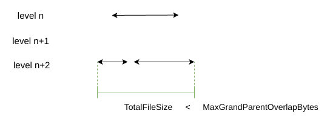

## 背景

紧接上篇，通过 PickCompaction 确定了
- 需要 Compaction 的层级 level 及文件
- 确定了 level + 1 层文件
- 确定了 level + 2 层文件

接下来，我们来分析后续的 Compaction 操作

<!--more-->

## 分析

leveldb 并不是之间直接将 level 与 level + 1 层进行进行 Compaction ，而是有一个优化：根据所选文件进行判断这是否是一次简单的压缩
```cpp
 // c 代表上一次 PickCompaction 操作是否有需要 Compaction 的文件
 // c == nullptr 代表当前无文件需要处理
 if (c == nullptr) {
    // Nothing to do
  } else if (!is_manual && c->IsTrivialMove()) {
    ...
  } else {
    ...
  }
```

is_manual 是前文提到过的：是否是通过 leveldb 对外接口手动触发 Compaction ，默认是 false。

关注 IsTrivialMove 函数
```cpp
bool Compaction::IsTrivialMove() const {
  const VersionSet* vset = input_version_->vset_;
  // Avoid a move if there is lots of overlapping grandparent data.
  // Otherwise, the move could create a parent file that will require
  // a very expensive merge later on.
  return (num_input_files(0) == 1 && num_input_files(1) == 0 &&
          TotalFileSize(grandparents_) <=
              MaxGrandParentOverlapBytes(vset->options_));
}
```

简单来说,需要按照如下图所示：



- level 层 (input_[0]) 的文件个数为 1 
- level + 1 层 (input[1]) 的文件个数为 0 
- 如果存在 level + 2 层有重叠文件(grandparents_)则总大小应小于某一个限制(在 [options 配置](https://github.com/google/leveldb/blob/main/include/leveldb/options.h) 中)

因为当符合上述的要求时，可以直接将 level 层中的文件移动到 level n + 1 层中，此时又可以避免移动后 level + 1 层与 level + 2 层文件重叠率太高

接下来进行所谓的 TrivialMove
```cpp
 if (c == nullptr) {
    // Nothing to do
  } else if (!is_manual && c->IsTrivialMove()) {
    // Move file to next level
    assert(c->num_input_files(0) == 1);
    FileMetaData* f = c->input(0, 0);
    c->edit()->RemoveFile(c->level(), f->number);
    c->edit()->AddFile(c->level() + 1, f->number, f->file_size, f->smallest,
                       f->largest);
    status = versions_->LogAndApply(c->edit(), &mutex_);
    if (!status.ok()) {
      RecordBackgroundError(status);
    }
  } else {
    ...
  }
```

在 TrivialMove 中，因为 level 层只存在一个文件，所以将该文件从 level 层删除，再添加到 level + 1 层中, 最后调用 LogAndApply 提交本次修改
```
这里其实会涉及到版本控制的概念。
这里的 edit() 返回的是一个 VersionEdit 类，通过该类可以记录当前版本中的修改。
该类内部维护了一个 set 类 ：deleted_files_ 表示删除的文件
vector 类 ：new_files_ 新增的文件
```

之后便是一般模式下的 Compaction
```cpp
  if (c == nullptr) {
    // Nothing to do
  } else if (!is_manual && c->IsTrivialMove()) {
    // Move file to next level
  } else {
    CompactionState* compact = new CompactionState(c);
    status = DoCompactionWork(compact);
    if (!status.ok()) {
      RecordBackgroundError(status);
    }
    
    // 清理并删除不必要的文件
    CleanupCompaction(compact);
    c->ReleaseInputs();
    RemoveObsoleteFiles();
  }
```

上面代码主要分为两部分：一部分为 [DoCompactionWork](https://github.com/google/leveldb/blob/main/db/db_impl.cc#L892) 进行 Compaction 任务，一部分是后续的清理首位工作。

CompactionState 是一个辅助类，用于帮我们去除过时版本，构建输出文件

由于代码篇幅原因，我们截取部分核心代码进行分析
```cpp
if (snapshots_.empty()) {
    compact->smallest_snapshot = versions_->LastSequence();
  } else {
    compact->smallest_snapshot = snapshots_.oldest()->sequence_number();
  }

  Iterator* input = versions_->MakeInputIterator(compact->compaction);
```

首先获取当前最小快照，smallest_snapshot 虽然名称带有 snapshot ，但是确实一个 SequenceNumber，当一个 key 的 SequenceNumber 小于 smallest_snapshot，则作为过时的记录，会将其删除，所以该段代码会根据当前的快照集合来选定一个最早的 SequenceNumber ，快照用于访问过去版本的记录，如果当前版本集为空，而代表不需要再访问过去版本的记录，则以当前版本集的最后序列号作为 smallest_snapshot ，如果存在版本集，则以最早快照的序列号作为 smallest_snapshot

input 是 [MergingIterator](https://github.com/google/leveldb/blob/main/table/merger.h) 类型用于遍历之前选择的文件

接下来便是通过迭代器访问每一个 Key
```cpp
while (input->Valid() && !shutting_down_.load(std::memory_order_acquire)) {
    ...
    input->Next();
}
```

在循环的内部首先判断是否存在 immutable，优先处理它
```cpp
    // Prioritize immutable compaction work
    if (has_imm_.load(std::memory_order_relaxed)) {
      const uint64_t imm_start = env_->NowMicros();
      mutex_.Lock();
      if (imm_ != nullptr) {
        CompactMemTable();
        // Wake up MakeRoomForWrite() if necessary.
        background_work_finished_signal_.SignalAll();
      }
      mutex_.Unlock();
    }
```

[ShouldStopBefore](https://github.com/google/leveldb/blob/main/db/version_set.cc#L1538) 会累计遍历的 key 与 level + 2 层 (之前记录的 grandparents_ ) 的重叠，当重叠太多则将当前的数据写入到 SSTable 文件中
```cpp
    Slice key = input->key();
    if (compact->compaction->ShouldStopBefore(key) &&
        compact->builder != nullptr) {
      status = FinishCompactionOutputFile(compact, input);
      if (!status.ok()) {
        break;
      }
    }
```

前置判断结束后，便要进行 key 的解析，leveldb 中通过 InternalKey 字段中的 SequenceNumber 删除过时数据

首先解析 key ，如果解析失败则清空数据
```cpp
    if (!ParseInternalKey(key, &ikey)) {
      // Do not hide error keys
      current_user_key.clear();
      has_current_user_key = false;
      last_sequence_for_key = kMaxSequenceNumber;
    } 
```

之后判断当前是否存在解析过的 key ，如果不存在，则将当前 key 设置为 current_user_key ，如果存在，则判断两者的 user_key 是否相同，如果不同，则也更新 current_user_key
```cpp
    if (!has_current_user_key ||
          user_comparator()->Compare(ikey.user_key, Slice(current_user_key)) !=
              0) {
        // First occurrence of this user key
        current_user_key.assign(ikey.user_key.data(), ikey.user_key.size());
        has_current_user_key = true;
        last_sequence_for_key = kMaxSequenceNumber;
      }
```

根据序列号删除过时 key
```cpp
    if (last_sequence_for_key <= compact->smallest_snapshot) {
        // Hidden by an newer entry for same user key
        drop = true;  // (A)
      } else if (ikey.type == kTypeDeletion &&
                 ikey.sequence <= compact->smallest_snapshot &&
                 compact->compaction->IsBaseLevelForKey(ikey.user_key)) {
        // For this user key:
        // (1) there is no data in higher levels
        // (2) data in lower levels will have larger sequence numbers
        // (3) data in layers that are being compacted here and have
        //     smaller sequence numbers will be dropped in the next
        //     few iterations of this loop (by rule (A) above).
        // Therefore this deletion marker is obsolete and can be dropped.
        drop = true;
      }
```

代码段中是 leveldb 中原本的注释，将一个 key 标记为 drop (即丢弃) 需要满足以下条件
- sequence 小于等于上文记录的最小快照序列号
- 标记为 kTypeDeletion ，解析 sequence 小于等于最小快照序列号，判断当前 key 是否位于 BaseLevel

如果当前 key 不需要删除则将其加入到新的 SSTable 中
```cpp
    if (!drop) {
      // builder 是 TableBuilder 类
      // 上一章说过该类的作用是辅助构造 table
      if (compact->builder == nullptr) {
        status = OpenCompactionOutputFile(compact);
        if (!status.ok()) {
          break;
        }
      }

      // 由于内部有序，第一个 key 一定是最小的
      if (compact->builder->NumEntries() == 0) {
        compact->current_output()->smallest.DecodeFrom(key);
      }

      // 记录后续的 key
      compact->current_output()->largest.DecodeFrom(key);
      compact->builder->Add(key, input->value());

      // 当文件过大时，构建 SSTable
      // 之后重新写入一个文件
      if (compact->builder->FileSize() >=
          compact->compaction->MaxOutputFileSize()) {
        status = FinishCompactionOutputFile(compact, input);
        if (!status.ok()) {
          break;
        }
      }
    }
```

之后收集本次 Compaction 的信息
```cpp
  CompactionStats stats;
  stats.micros = env_->NowMicros() - start_micros - imm_micros;
  for (int which = 0; which < 2; which++) {
    for (int i = 0; i < compact->compaction->num_input_files(which); i++) {
      stats.bytes_read += compact->compaction->input(which, i)->file_size;
    }
  }
  for (size_t i = 0; i < compact->outputs.size(); i++) {
    stats.bytes_written += compact->outputs[i].file_size;
  }

  mutex_.Lock();
  stats_[compact->compaction->level() + 1].Add(stats);
```

将本次新建立的 SSTable 文件写入到 VersionEdit 中，并提交到当前版本集中
```cpp
if (status.ok()) {
    status = InstallCompactionResults(compact);
}

Status DBImpl::InstallCompactionResults(CompactionState* compact) {
  mutex_.AssertHeld();

  // Add compaction outputs
  compact->compaction->AddInputDeletions(compact->compaction->edit());
  const int level = compact->compaction->level();
  for (size_t i = 0; i < compact->outputs.size(); i++) {
    const CompactionState::Output& out = compact->outputs[i];
    compact->compaction->edit()->AddFile(level + 1, out.number, out.file_size,
                                         out.smallest, out.largest);
  }
  return versions_->LogAndApply(compact->compaction->edit(), &mutex_);
}  
```

至此，一次 Compaction 结束。