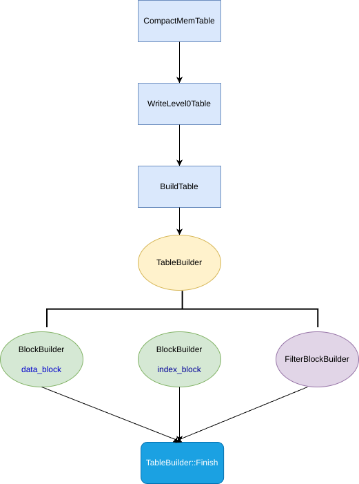

## 背景


图片来自于[SmartKeyerror](https://github.com/SmartKeyerror/reading-source-code-of-leveldb-1.23/tree/master/debug/articles/06-SSTable-data-block)

此图为 SSTable 的总览图，如图所示主要由下面几个模块构成
- Data Block ： 具体的数据块，存储 (key value)，并在存储时通过前缀压缩等方法进行优化
- Meta Block ： 为了方便查询所建立的过滤块，leveldb中使用的是布隆过滤器，该过滤块可以快速判断 key 是否存在
- Metaindex Block ： 对 Meta Block 块的索引块，默认 Meta Block 为 4K 大小
- Index Block ：对 Data Block 块的索引块
- Footer ：存储 Metaindex Block 与 Index Block 的偏移地址

<!--more-->

## 分析

### 触发 Compaction

接下来我们将从 leveldb 的源码部分看看一个 SSTable 究竟是如何产生的

首先是一个大致的调用逻辑:


leveldb 会在对外接口 [open](https://github.com/google/leveldb/blob/main/db/db_impl.cc#L1497) 中去调用 [MaybeScheduleCompaction](https://github.com/google/leveldb/blob/main/db/db_impl.cc#L662)  函数，从名字中得知，此函数应该是调度触发压缩(Compaction)，为什么是Maybe呢？

```cpp
void DBImpl::MaybeScheduleCompaction() {
  mutex_.AssertHeld();
  if (background_compaction_scheduled_) {
    // Already scheduled
  } else if (shutting_down_.load(std::memory_order_acquire)) {
    // DB is being deleted; no more background compactions
  } else if (!bg_error_.ok()) {
    // Already got an error; no more changes
  } else if (imm_ == nullptr && manual_compaction_ == nullptr &&
             !versions_->NeedsCompaction()) {
    // No work to be done
  } else {
    background_compaction_scheduled_ = true;
    env_->Schedule(&DBImpl::BGWork, this);
  }
}
```
原因在与当需要进行 Compaction 时，需要检测
- 是否有正在进行 Compaction 的线程
- 是否关闭数据库
- 是否存在 immutable ，是否手动 Compaction, 当前版本中不需要进行 Compaction

之后便可以调用核心的 `env_->Schedule(&DBImpl::BGWork, this);`

```
env_ 代表的是环境变量，在这里是一个抽象类
leveldb 针对于 Linux 与 Windows 分别实现了两套接口，调用各自的系统调用函数，分别是 PosixEnv 与 WindowEnv
笔者讲解所采用的是 PosixEnv，今后默认便是此环境
```

DBImpl::BGWork 是一个函数，而 this 是该函数的参数

此函数将会启用一个后台线程运行 Compaction 操作,此处是用条件变量实现的生产与消费者模型
```cpp
void PosixEnv::Schedule(
    void (*background_work_function)(void* background_work_arg),
    void* background_work_arg) {
  background_work_mutex_.Lock();

  // Start the background thread, if we haven't done so already.
  if (!started_background_thread_) {
    started_background_thread_ = true;
    std::thread background_thread(PosixEnv::BackgroundThreadEntryPoint, this);
    background_thread.detach();
  }

  // If the queue is empty, the background thread may be waiting for work.
  if (background_work_queue_.empty()) {
    background_work_cv_.Signal();
  }

  background_work_queue_.emplace(background_work_function, background_work_arg);
  background_work_mutex_.Unlock();
}
```

现在我们重点看看后台线程所运行的任务: DB::BGWork
```cpp
void DBImpl::BGWork(void* db) {
  reinterpret_cast<DBImpl*>(db)->BackgroundCall();
}

void DBImpl::BackgroundCall() {
  MutexLock l(&mutex_);
  assert(background_compaction_scheduled_);
  if (shutting_down_.load(std::memory_order_acquire)) {
    // No more background work when shutting down.
  } else if (!bg_error_.ok()) {
    // No more background work after a background error.
  } else {
    BackgroundCompaction();
  }

  background_compaction_scheduled_ = false;

  // Previous compaction may have produced too many files in a level,
  // so reschedule another compaction if needed.
  MaybeScheduleCompaction();
  background_work_finished_signal_.SignalAll();
}
```

该函数将传入参数转换为 DBImpl* 型，因为在上一步 Schedule 时传入参数解释为 void* 

在这里，BGWork 调用 BackgroundCall ，增加了代码的可扩展性，如果我想重写一个后台线程执行逻辑，只需要给 DBImpl 再自定义一个方法，之后调用该方法即可

这里依然是先检测当前数据库的一些状态，由于上一次 Compaction 可以导致某一 level 层级的文件被压入到 level + 1 中，导致该层文件过多或超出层级限制，所以还会再进行一次 MaybeScheduleCompaction() ，从头再来

### Immutable -> SSTable

而这之后便是 Compaction 的核心逻辑 ：DBImpl::BackgroundCompaction()

由于本文的重点是 SSTable 的构建，所以只会关注 Immutable -> SSTable 核心便是下面的代码：

```cpp
void DBImpl::BackgroundCompaction() {
  mutex_.AssertHeld();

  if (imm_ != nullptr) {
    CompactMemTable();
    return;
  }

  ...

}
```

首先判断当前是否持有锁，之后通过判断是否存在 Immutable ,如果存在则将该 Immutable 压缩为 SSTable 

下面是大致的调用逻辑图



在 [CompactMemTable](https://github.com/google/leveldb/blob/main/db/db_impl.cc#L549) 中提取构建 SSTable 相关代码如下：

```cpp
void DBImpl::CompactMemTable() {
  ...
  Status s = WriteLevel0Table(imm_, &edit, base);
  ...

  // 将此次修改记录到 edit 中
  // 移除过时 log 文件
  // 更新版本信息
  if (s.ok()) {
    ...
    s = versions_->LogAndApply(&edit, &mutex_);
    ...
  }

  // 删除写入成功的 Immutable
    if (s.ok()) {
    ...
    RemoveObsoleteFiles();
  } else {
    RecordBackgroundError(s);
  }
}
```

为了不深究过多细节，笔者只提取部分逻辑代码来展示调用流程

由上可见，此函数中核心逻辑便是 WriteLevel0Table ，将原本的 Immutable 写入为 SSTable ， 之后通过将本次修改追加到 edit 中更新当前版本信息，最后删除已经写入成功的 Immutable

```
leveldb 实现了版本控制 ：
Version N + VersionEdit => Version N+1

类似于 git 通过 commmit 可以跳转到任何一次版本中
```

笔者会在之后写一篇详细讲解 leveldb 的版本控制

接下来重点看看 WriteLevel0Table

```cpp
Status DBImpl::WriteLevel0Table(MemTable* mem, VersionEdit* edit,
                                Version* base) {
  FileMetaData meta;
  meta.number = versions_->NewFileNumber();
  Iterator* iter = mem->NewIterator();
  ...

  s = BuildTable(dbname_, env_, options_, table_cache_, iter, &meta);

  ...

  if (s.ok() && meta.file_size > 0) {
    edit->AddFile(level, meta.number, meta.file_size, meta.smallest,
                  meta.largest);
  }

  ...
  return s;
}
```

FileMetaData 是一个 SSTable 的元数据，用来记录这个表的信息，MemTable 内部是一个跳表，获取其迭代器用来遍历跳表

```
FileMetaData 其实是版本控制中的概念，用来描述 SSTable 中的信息

Version 中的成员变量：
std::vector<FileMetaData*> files_[config::kNumLevels];
```

所以上面代码的核心便是创建一个 SSTable,并将该表信息写入到
meta 中，最后将此次修改记录到 edit 中。

### 构建 SSTable

具体的 SSTable 构建位于 [BuildTable](https://github.com/google/leveldb/blob/main/db/builder.cc#L17) 中，依然提取核心相关代码进行讲解

<!--more-->

```cpp
Status BuildTable(const std::string& dbname, Env* env, const Options& options,
                  TableCache* table_cache, Iterator* iter, FileMetaData* meta) {
   ...
  // 创建一个 TableBuilder 构造器
  TableBuilder* builder = new TableBuilder(options, file);

  ...

  // 遍历跳表迭代器，将 [key,value] 插入到 builder 中
  for (; iter->Valid(); iter->Next()) {
    key = iter->key();
    builder->Add(key, iter->value());
  }

  ...

  // 构建 Filter Block , Metaindex Block , Index Block 
  s = builder->Finish();
  ...
}
```
由上面的代码可知：一个 SSTable 的 Data_Block 在 BuildTable 中遍历跳表迭代器构建，而其他的 Block 在 Finish 中完成构建

首先分析 [builder->Add](https://github.com/google/leveldb/blob/main/table/table_builder.cc#L94)

```cpp
void TableBuilder::Add(const Slice& key, const Slice& value) {
  // 检查状态
  Rep* r = rep_;
  assert(!r->closed);
  if (!ok()) return;
  if (r->num_entries > 0) {
    assert(r->options.comparator->Compare(key, Slice(r->last_key)) > 0);
  }

  // 当一次 data_block 写入到文件中，pending_index_entry 变为 true (Flush 中)
  // 此时对写入到文件的 data_block 建立索引
  if (r->pending_index_entry) {
    assert(r->data_block.empty());
    r->options.comparator->FindShortestSeparator(&r->last_key, key);
    std::string handle_encoding;
    r->pending_handle.EncodeTo(&handle_encoding);
    r->index_block.Add(r->last_key, Slice(handle_encoding));
    r->pending_index_entry = false;
  }

  // 向 filter_block 中插入 key
  if (r->filter_block != nullptr) {
    r->filter_block->AddKey(key);
  }

  // 向 data_block 中写入本次 [key value]
  r->last_key.assign(key.data(), key.size());
  r->num_entries++;
  r->data_block.Add(key, value);

  // 如果 data_block 达到最大限 4K 则将其写入文件当中
  const size_t estimated_block_size = r->data_block.CurrentSizeEstimate();
  if (estimated_block_size >= r->options.block_size) {
    Flush();
  }
}
```

由上可知，每一个新的 [key , value] 是通过跳表迭代器顺序获取的，所以自身的有序性可以通过前缀压缩的方式写入到 data_block 中，并根据设置建立 filter_block, 当 data_block 到达 4K 时，会触发 Flush ，将 data_block 写入到 SStable 中，并将 ending_index_entry 设为 true,当下一次 key 到来时，为上一次的 data_block 建立索引


接下来看看 [builder->Finish](https://github.com/google/leveldb/blob/main/table/table_builder.cc#L213)

```cpp
// block_contents : 具体的块数据
// CompressionType :  压缩方式
// BlockHandle : 记录这个块的起始偏移地址与总大小，方便后续使用
void TableBuilder::WriteRawBlock(const Slice& block_contents,
                                 CompressionType type, BlockHandle* handle) {
  Rep* r = rep_;
  handle->set_offset(r->offset);
  handle->set_size(block_contents.size());
  r->status = r->file->Append(block_contents);
  if (r->status.ok()) {
    char trailer[kBlockTrailerSize];
    trailer[0] = type;
    uint32_t crc = crc32c::Value(block_contents.data(), block_contents.size());
    crc = crc32c::Extend(crc, trailer, 1);  // Extend crc to cover block type
    EncodeFixed32(trailer + 1, crc32c::Mask(crc));
    r->status = r->file->Append(Slice(trailer, kBlockTrailerSize));
    if (r->status.ok()) {
      r->offset += block_contents.size() + kBlockTrailerSize;
    }
  }
}
```

这段代码核心便是两个 r->file->Append() 函数，
```cpp
r->file->Append(block_contents); // 将具体的块数据写入到文件中
r->file->Append(Slice(trailer, kBlockTrailerSize)); // 将这块数据的crc32校验值写入到文件中
```

接下来看看这3个块的具体写入方式

#### filter block
```cpp
// Write filter block
if (ok() && r->filter_block != nullptr) {
  WriteRawBlock(r->filter_block->Finish(), kNoCompression,
                &filter_block_handle);
  }
```

filter_block 是一个 [FilterBlockBuilder](https://github.com/google/leveldb/blob/main/table/filter_block.h#L30) 用于辅助构造 FilterBlock

- r->filter_block->Finish() 用于返回具体的块数据
- kNoCompression ： 代表无压缩方式
- filter_block_handle ： 记录这这个块的起始偏移量与总大小

#### metaindex block
```cpp
// Write metaindex block
  if (ok()) {
    BlockBuilder meta_index_block(&r->options);
    if (r->filter_block != nullptr) {
      // Add mapping from "filter.Name" to location of filter data
      std::string key = "filter.";
      key.append(r->options.filter_policy->Name());
      std::string handle_encoding;
      filter_block_handle.EncodeTo(&handle_encoding);
      meta_index_block.Add(key, handle_encoding);
    }

    WriteBlock(&meta_index_block, &metaindex_block_handle);
  }
```

将上一步生成的 filter_block_handle 压缩为 string 类型，并将其添加到 meta_index_block 块中，最后将该块写入到 SSTable 文件中，并获取记录其起始偏移量与大小的 metaindex_block_handle

#### index block
```cpp
  // Write index block
  if (ok()) {
    if (r->pending_index_entry) {
      r->options.comparator->FindShortSuccessor(&r->last_key);
      std::string handle_encoding;
      r->pending_handle.EncodeTo(&handle_encoding);
      r->index_block.Add(r->last_key, Slice(handle_encoding));
      r->pending_index_entry = false;
    }
    WriteBlock(&r->index_block, &index_block_handle);
  }
```

pending_index_entry 判断的是当前 data_block 是否为空，如果不为空，则 pending_index_entry 为真，将 pending_handle(data_block 的 BlockHandle) 写入 index_block,最后将 index_block 写入到文件中，获取 index_block_handle

#### footer
```cpp
  // Write footer
  if (ok()) {
    Footer footer;
    footer.set_metaindex_handle(metaindex_block_handle);
    footer.set_index_handle(index_block_handle);
    std::string footer_encoding;
    footer.EncodeTo(&footer_encoding);
    r->status = r->file->Append(footer_encoding);
    if (r->status.ok()) {
      r->offset += footer_encoding.size();
    }
  }
```

记录 metaindex_block 与 index_block 的起始偏移地址，将 footer 压缩为 string 写入到文件当中