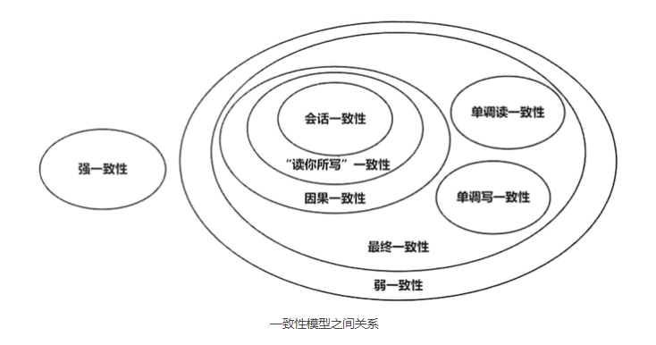

从[《从Paxos到Zookeeper》读书笔记](./Conprotocol.md) 一文中，探讨了从集中式到分布式的发展，而在分布式中涉及到两个核心的概念 CAP 与 BASE，而后者则是对前者在实践中权衡的结果。其核心思想是即使无法做到强一致性，但每个应用都可以根据自身的业务特点，采用适当的方式来使系统达到最终一致性。

那么究竟什么是一致性？各种一致性的含义到底有什么不同？与共识又有什么区别？本文将进行逐一探讨。

<!--more-->

## 什么是一致性

`一致性`这个词其实非常具有迷惑性，因为它在不同的场景中都涉及到，但是含义却又不同

#### ACID 中的一致性

事务中的一致性指的是让数据库处于一致的状态，那什么是一致的状态?比如一次事务涉及金钱的转入与转出，那么这个事务就必须保证转入转出的金额保持一致，从而保证总金额不变,抽象来看，对数据库每进行一次事务操作，其状态就发生一种变化，那么只要数据库的起始状态是一致的，每一次操作保证一致，那么数据库的状态就能保持一致。

所以 ACID 中的一致性，是一个很偏应用层的概念，这与原子性、隔离性和持久性不同，因为这些都是数据库本身提供的，而一致性，则是由特定的业务场景决定的，要做到一致性，是需要依赖数据库的原子性(出错回滚)和隔离性(并发)。

结论是 ACID 的一致性与分布式中的一致性并没有什么关系。

#### CAP 中的一致性

CAP 的三个字母分别代表了分布式系统的三个特性：一致性、可用性和分区容错性。而 CAP 定理指出：任何一个分布式系统只能同时满足三个特性中的两个。

那么 CAP 中的一致性又是什么含义呢？在证明 CAP 的论文中，提到 C 指的是 linearizable consistency 也就是 `线性一致性`,当然为与 BASE 理论中的一致性作区别，它还有另外一个名字叫做 `强一致性`。

线性一致性又是什么？大体是说：在并发的环境中，不同的操作之间可能不同的状态，它们可能是具有严格先后关系的，可能是并发操作的。那么如果能把所有的操作排列成一个`合法`的`全局线性顺序`，那么就是线性一致性。

那么，怎样才算合法？如果一个读操作已经读到了某个值，那么下一个对于同一个数据对象的读操作就必须读取到同样的值（除非在两次读操作之间还存在别的写入操作）。对于一个分布式存储系统来说，线性一致性的含义可以用一个具体的描述来取代：对于任何一个数据对象来说，系统表现得就像它只有一个副本一样。

从本质来看，线性一致性，也被成为强一致性，大概就是因为线性一致性需要在多个副本上的数据保证如此之强的一致性，以至于让系统表现的只有一个副本。

#### BASE 中的一致性

根据 CAP 定律，当出现网络分区时，我们必须在可用性和强一致性之间进行取舍，现如今，大型分布式系统也逐步倾向系统的高可用和高性能，取舍的结果就是降低系统提供的一致性保障，采用`弱一致性`，其中核心便是`最终一致性`。

最终一致性是不再对外提供单一系统视图 (SSI)，即不再让系统“表现得像只有一个副本”一样，它允许读到旧版本的数据。最终一致性是弱一致性的一种特殊形式，存储系统保证，如果对象没有新的修改操作，那么所有的访问最终都会返回最新写入的值。但是这个最终收敛的时间却无法保证。

## 线性一致性和顺序一致性

强一致性包含线性一致性和顺序一致性，而前者的约束性更强

前文中，我们提到分布式系统中强一致性对外应该表现的像只有一个副本一样。
或许我们也可以这样理解：如果将原本多进程并发执行的操作重排成一个全局有序的序列，表现出好像是顺序执行的一样，那么此分布式系统对外表现就好像总是由一个操作一个副本一样。

所以核心便是将并发执行的操作重排为`全局有序`。

#### 顺序一致性
如果一个并发执行过程所包含的所有读写操作能够重排成一个全局线性有序的序列，并且这个序列满足以下两个条件，那么这个并发执行过程就是满足顺序一致性的：

- 条件 I：重排后的序列中每一个读操作返回的值，必须等于前面对同一个数据对象的最近一次写操作所写入的值。
- 条件 II：原来每个进程中各个操作的执行先后顺序，在这个重排后的序列中必须保持一致。
#### 线性一致性
线性一致性的定义，与顺序一致性非常相似，也是试图把所有读写操作重排成一个全局线性有序的序列，但除了满足前面的条件 I 和条件 II 之外，还要同时满足一个条件：

- 条件 III：不同进程的操作，如果在时间上不重叠，那么它们的执行先后顺序，在这个重排后的序列中必须保持一致。
#### 异同
1. 它们都试图让系统“表现得像只有一个副本”一样。
2. 它们都保证了各自程序内部执行顺序不会被打乱。体现在条件 II 对于进程内各个操作的排序保持上。
3. 线性一致性考虑了时间先后顺序，而顺序一致性没有。
4. 满足线性一致性的执行过程，肯定都满足顺序一致性；反之不一定。
4. 线性一致性隐含了时效性保证（recency guarantee）。它保证我们总是能读到数据最新的值。
5. 在顺序一致性中，我们有可能读到旧版本的数据。

## 分布式事务与共识算法的关系

`共识问题` (consensus problem)。这是分布式系统中的一个十分基础而核心的问题，它表示如何在分布式系统中的多个节点之间就某事达成共识。

Paxos，是解决共识问题的通用算法。它允许每个节点提出自己的提议(称为proposal)，而 Paxos 算法能够不借助于任何中心化节点，保证各个节点之间对于提议最终达成一致。这里的 proposal ，是一个抽象的概念，它可以包含任何你想达成共识的数值。

`分布式事务`可以看作是由多个分布式的操作序列的组成，上文中，我们关注了ACID中的一致性，现在关注一下原子性

ACID 中的`原子性`，要求事务的执行要么全部成功，要么全部失败，而不允许出现“部分成功”的情况。在分布式事务中，这要求参与事务的所有节点，要么全部执行 Commit 操作，要么全部执行 Abort 操作。换句话说，参与事务的所有节点，需要在“执行Commit还是Abort”这一点上达成一致（其实就是共识）。这个问题被称为`原子提交问题`（Atomic Commitment Problem），而能够解决原子提交问题的算法，则被称为`原子提交协议`（Atomic Commitment Protocal，简称ACP）。2PC和3PC，属于原子提交协议两种不同的具体实现。

此时，我们似乎发现了原子提交问题与共识问题的关联性：
- 共识问题，解决的是如何在分布式系统中的多个节点之间就某个提议达成共识。
- 原子提交问题，解决的是参与分布式事务的所有节点在“执行Commit还是Abort”这一点上达成共识。

原子提交问题被抽象成一个新的一致性问题，称为uniform consensus问题，它是与通常的共识问题（consensus problem）不同的问题，而且是更难的问题。`uniform consensus` 要求所有节点（包括故障节点）都要达成共识；而 `consensus` 问题只关注没有发生故障的节点达成共识。

总结：
- 共识问题解决的是如何在分布式系统中的`多个节点`之间就`某个提议`达成共识。它只关注没有发生故障的节点达成共识就可以了。
- 在分布式事务中，ACID中的原子性，引出了原子提交问题，它解决的是参与分布式事务的`所有节点`在`“执行Commit还是Abort”`这一点上达成共识。原子提交问题属于 uniform consensus 问题，要求所有节点（包括故障节点）都要达成共识，是比 consensus 问题更难的一类问题。

## 参考

[条分缕析分布式：到底什么是一致性？](https://mp.weixin.qq.com/s?__biz=MzA4NTg1MjM0Mg==&mid=2657261779&idx=1&sn=9fb74c24f8863837d584a96536ba8189&scene=21#wechat_redirect)

[条分缕析分布式：到底什么是一致性？](https://mp.weixin.qq.com/s?__biz=MzA4NTg1MjM0Mg==&mid=2657261779&idx=1&sn=9fb74c24f8863837d584a96536ba8189&chksm=8447910ab330181cc3c6e388869d05a1e23cfba1b16e87ed1a2cd93d61aaa36a6ffd2281c3f8&cur_album_id=1550842358601187329&scene=189#wechat_redirect)
