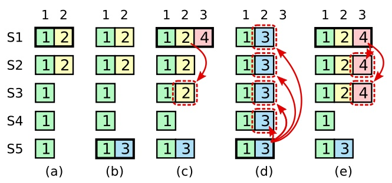

Raft 是一种为了管理复制日志的一致性算法，它提供了与 Paxos 算法相同的功能与性能，而 Paxos 算法是为了最终唯一选定一个提案，有关 Paxos 的介绍，可以参考[Paxos Made Simple](../paper/paxos.md) 一文，为了提升可理解性，Raft 将一致性算法分解为几个关键模块，例如：领导者选举、日志复制和安全性，通过通过 Leader 来提供一个更强的一致性来减少需要考虑的状态数量。

<!--more-->

## 介绍

Raft 算法在许多方面与现有的一致性算法都很相似，但是它也有一些独特的特性：

1. 强领导者：Raft 使用一种更强的领导能力形式。比如，日志条目只从领导人发送给其他的服务器。这种方式简化了对复制日志的管理并且使得 Raft 算法更加易于理解。
2. 领导选举：Raft 通过随机超时时间来选举领导者，在解决冲突的时候会更加简单快捷。
3. 成员关系调整：Raft 通过联合共识来处理集群成员变更的问题。

## 复制状态机

一致性算法是从复制状态机的背景下提出的，其正确性主要来源于复制状态机的性质：
```txt
任何初始状态一样的状态机，如果执行的命令序列一样，则最终达到的状态也一样。
如果将此特性应用在多参与者进行协商共识上，可以理解为系统中存在多个具有完全相同的状态机（参与者）
这些状态机能最终保持一致的关键就是起始状态完全一致和执行命令序列完全一致。
```

所以共识算法常被用来确保每一个节点上的状态机一定都会按照相同的顺序执行相同的命令，并最终处于相同的状态。


由上图可知，Client 将操作发生给 Server ，由于分布式网络通信之间的不确定性，不同节点可能会接受到顺序不一致的操作指令，而 Consensus Modlue 的作用在于让大多数节点就指令顺序达成共识。不过需要注意的是，这里指的是确保提交给状态机(State Machine)的日志顺序是一致的，而不同节点的 Log 日志可能会有差异，因为有些日志项可能只是暂时添加,却尚未提交。

## Raft 一致性算法

Raft 通过选举一个领导者，然后给予它一切管理复制日志的责任来实现一致性，领导者从客户端接受到日志条目(log entries)，把日志条目复制到其他服务器上，并告诉其他服务器什么时候可以将日志条目应用到状态机中，这样的方式简化了对复制日志的管理，数据总是从领导者流向其他服务器。当一个领导者出现故障时，其他节点会在心跳超时的情况下重新选举一个新的领导者。

通过领导者的方式，Raft 将一致性问题分解为三个独立的子问题：
- 领导选举：当现存领导者发生故障时，选举出一个新的领导者
- 日志复制：领导者将从客户端接受到的日志复制到其他节点中，并要求其他节点的日志和自己保持一致。
- 安全性：如果有任何的节点已经应用了一个确定的日志到它的状态机中，那么其他节点不能在同一个日志索引处应用一个不同的指令

## 节点类型

Raft 将所有节点分为三个身份：
- Leader ：集群中最多只有一个 Leader,负责响应客户端、发起心跳、复制日志
- Candidate ：leader 选举过程中的临时角色，由 follower 转化而来，发起投票与精选
- Follower ：接受 leader 的心跳、同步日志，投票给 Candidate


Follower 只响应来自其他服务器的请求。如果 Follower 接收不到消息，那么他就会变成 Candidate 并发起一次选举。获得集群中大多数选票的候选人将成为 Leader。在一个任期内，Leader 会一直持续到自己宕机。

## 任期


时间被划分成一个个的任期，每个任期始于一次选举。在选举成功后，Leader 会管理整个集群直到任期结束。有时候选举会失败，那么这个任期就会没有 Leader 而结束。

不同的服务器节点可能多次观察到 term 之间的转换，但在某些情况下，一个节点也可能观察不到任何一次选举或者整个 term 全程。term 在 Raft 算法中充当逻辑时钟（类似于 Lamport timestamp）的作用，这会允许服务器节点查明一些过期的信息比如过期的 leader。

每个节点都会存储当前 term 号，这一编号在整个时间内单调增长。当服务器之间通信的时候会交换当前 term 号；如果一个服务器的当前 term 号比其他人小，那么他会更新自己的 term 到较大的 term 值。如果一个 candidate 或者 leader 发现自己的 term 过期了，那么他会立即退回 follower。如果一个节点接收到一个包含过期 term 号的请求，那么它会拒绝或忽略这个请求。这实际上就是一个 [Lamport 逻辑时钟](../paper/time-clocks.md) 的具体实现。

## Leader 选举

Raft 使用心跳来维持 leader 身份。任何节点都以 follower 的身份启动。 leader 会定期的发送心跳给所有的 follower 以确保自己的身份。 每当 follower 收到心跳后，就刷新自己的 electionElapsed，重新计时。

一旦一个 follower 在指定的时间内没有收到任何 RPC（称 electionTimeout），则会发起一次选举。 当 follower 试图发起选举后，其身份转变为 candidate，在增加自己的 term 后， 会向所有节点发起 RequestVoteRPC 请求，candidate 的状态会一直持续直到：
- 赢得选举
- 其他节点赢得选举
- 一轮选举结束，无人胜出

选举的方式非常简单，谁能获取到多数选票 (N/2 + 1)，谁就成为 leader。为了防止在同一时间有太多的 follower 转变为 candidate 导致无法选出绝对多数， Raft 采用了随机选举超时（randomized election timeouts）的机制， 每一个 candidate 在发起选举后，都会随机化一个新的选举超时时间， 一旦超时后仍然没有完成选举，则增加自己的 term，然后发起新一轮选举。

## 日志复制

leader 被选举后，就负责所有客户端请求。将每一个客户端请求作用于 RSM 中。

leader 收到客户端请求后，会生成一个 entry，包含 <index, term, cmd>，再将这个 entry 添加到自己的日志末尾后，向所有的节点广播该 entry。

follower 如果同意此条 entry,则将 entry 添加到自己的日志后，并返回同意。

如果 leader 收到了多数的同意答复，则将该 entry 应用到自己的状态机中，并将执行结果返回客户端，此时称该 entry 是 committed 的。该 committed 信息会随着随后的 AppendEntries 或 Heartbeat RPC 被传达到其他节点。如果 follower 发生崩溃或者运行缓慢，那么 leader 会不断尝试，直到所有 follower 同步应用所有日志。


Raft 保证下列两个性质：

- 如果在两个日志（节点）里，有两个 entry 拥有相同的 index 和 term，那么它们一定有相同的 cmd；
- 如果在两个日志（节点）里，有两个 entry 拥有相同的 index 和 term，那么它们前面的 entry 也一定相同。

通过”仅有 leader 可以生成 entry”来确保第一个性质， 第二个性质则通过一致性检查（consistency check）来保证。

leader 在通过 AppendEntriesRPC 和 follower 通讯时，会带上上一块 entry 的信息， 而 follower 在收到后会对比自己的日志，如果发现这个 entry 的信息（index、term）和自己日志内的不符合，则会拒绝该请求。一旦 leader 发现有 follower 拒绝了请求，则会与该 follower 再进行一轮一致性检查， 找到双方最大的共识点，然后用 leader 的 entries 记录覆盖 follower 所有在最大共识点之后的数据。

## 安全


正如上文所说，Leader 在接受到客户端的请求后，会将该请求追加到 log 末尾，只有当多数 follower 回应时才会将此条 log 提交。所以会造成不同节点存在不同未提交的日志条目，例如：场景 f 可能会这样发生，某服务器在任期 2 的时候是领导人，已附加了一些日志条目到自己的日志中，但在提交之前就崩溃了；很快这个机器就被重启了，在任期 3 重新被选为领导人，并且又增加了一些日志条目到自己的日志中；在任期 2 和任期 3 的日志被提交之前，这个服务器又宕机了，并且在接下来的几个任期里一直处于宕机状态。

在 Raft 算法中，Leader 是通过强制 follower 同步自己的日志来处理不一致的问题的，所以这意味着 follower 中与 leader 冲突的日志条可能会被 Leader 覆盖。

所以 Leader 的选举至关重要，如果选择一个落后太多日志的节点，那么很有可能造成数据丢失，这便要求我们对选举增加限制

#### 选举限制

在任何基于 Leader 的一致性算法中，Leader 必须存储所有已经提交的日志条目。

当 candidate 发送 RequestVoteRPC 时，会带上最后一个 entry 的信息。 所有的节点收到该请求后，都会比对自己的日志，如果发现自己的日志更新一些，则会拒绝投票给该 candidate。

判断日志新旧的方式：获取请求的 entry 后，比对自己日志中的最后一个 entry。 首先比对 term，如果自己的 term 更大，则拒绝请求。 如果 term 一样，则比对 index，如果自己的 index 更大（说明自己的日志更长），则拒绝请求。

#### 提交本任期的日志条目

正如前文所说，Leader 可以在本任期内提交被大多数 follower 接受的 entry，但是如果 Leader 在提交这条 entry 之前崩溃了，那么后续新 Leader 对待这条 entry 采取的方式应该是继续在达成多数后提交嘛？

下图展示了一种情况，一条已经被存储到大多数节点上的老日志条目，也依然有可能会被未来的领导人覆盖掉。



我们发现如果允许 Leader 提交之前任期的日志条目，那么 (c) 中的 trem-2 会提交，(d) 中的 trem-3 会提交，这不就造成了 index=2 的日志提交了两次！这是绝对不允许发生的，已经提交的日志不能够被覆盖！具体可以参考此 [博客](https://mp.weixin.qq.com/s/jzx05Q781ytMXrZ2wrm2Vg)

所以 raft 为了避免出现一致性问题，要求 leader 决不能提交过去 term 的 entry(即使该 entry 已经被复制到了多数节点上)。leader 永远只提交当前 term 的 entry， 过去的 entry 只会随着当前的 entry 被一并提交。

但是如果没有新的 entry 可以提交，那么过去 trem 的 entry 岂不是永远也无法提交了？为了解决这个问题，在 Leader 刚选举成功的时候，立即追加一条 no-op 日志，并立即复制到其它节点，no-op 日志一经提交，Leader 前面那些未提交的日志全部间接提交。

## 节点崩溃

如果 leader 崩溃，集群中的所有节点在 electionTimeout 时间内没有收到 leader 的心跳信息就会触发新一轮的选主。

如果 follower 和 candidate 崩溃相对而言就简单很多， 因为 Raft 所有的 RPC 都是幂等的，所以 Raft 中所有的请求，只要超时，就会无限的重试。follower 和 candidate 崩溃恢复后，可以收到新的请求，然后按照上面谈论过的追加或拒绝 entry 的方式处理请求。
```
Raft 的幂等性实现：
Follower 在接收到 AppendEntries 请求后，会检查本地日志中是否已经包含了相同索引和任期号的条目：
- 如果本地日志中已有相同的日志条目，说明该条目已经成功复制，Follower 会忽略这个条目，直接确认接收到这个请求，表示没有问题。
- 如果 prevLogIndex 或 prevLogTerm 不匹配（即 Follower 没有这条日志或存在不同的日志），Follower 会拒绝此次日志追加请求，返回失败信息。
Leader 需要回退 nextIndex 并重新发送更早的日志条目来修复不一致。
```

## 配置变更

raft 的配置变更一般分为两种方式：
- 一次变更一个
- 一次变更多个

前者实现相对简单，改动多个节点的配置变更可以被分成多个一次变更一个来执行；后者相对复杂，但在在某些场景下可用性更强。

#### 一次变更一个

如果一次性只变更一个节点，那么只需要简单的要求“在新/旧集群中，都必须取得多数（N/2+1）”， 那么这两个多数中必然会出现交集，这样就可以保证不会因为配置不一致而导致脑裂。


当 leader 收到集群变更的请求后，就会生成一个特殊的 entry 项用来保存配置， 在将配置项添加到 log 后，该配置立刻生效（也就是说任何节点在收到新配置后，就立刻启用新配置）。 然后 leader 将该 entry 扩散至多数节点，成功后则提交该 entry。 一旦一个新配置项被 committed，则视为该次变更已结束，可以继续处理下一次变更了。可以参考[博客](https://leehao.me/Raft-%E5%85%B1%E8%AF%86%E7%AE%97%E6%B3%95%E5%AD%A6%E4%B9%A0%E7%AC%94%E8%AE%B0-%E4%B8%89%EF%BC%9A%E6%88%90%E5%91%98%E5%8F%98%E6%9B%B4/)

#### 一次变更多台

当集群成员在变更时，为了保证服务的可用性（不发生中断），以及避免因为节点变更导致的一致性问题， Raft 提出了两阶段变更，当接收到新的配置文件后，集群会首先进入共同一致(joint consensus)状态， 待新的配置文件提交成功后，再回到普通状态。

- 日志条目被复制给集群中新、老配置的所有服务器。
- 新、旧配置的服务器都可以成为领导人。
- 达成一致（针对选举和提交）需要分别在两种配置上获得大多数的支持。


1. C_old,new 被创建，集群进入 joint consensus，leader 开始传播该 entry；
2. C_old,new 被 committed，也就是说此时多数节点都拥有了 C_old,new，此后 C_old 已经不再可能被选为 leader；
3. leader 创建并传播 C_new；
4. C_new 被提交，此后不在 C_new 内的节点不允许被选为 leader，如有 leader 不在 C_new 则自行退位。

## 参考

- [Raft 论文翻译](https://github.com/maemual/raft-zh_cn/blob/bc7735e6dbefaf5a0c335543901c5a7928fc3ef1/raft-zh_cn.md)
- [Raft 动画](https://thesecretlivesofdata.com/raft/)
- [Raft 算法介绍](https://tanxinyu.work/raft/#%E6%97%A5%E5%BF%97%E5%90%8C%E6%AD%A5)
- [Raft 共识算法学习笔记 ](https://leehao.me/Raft-%E5%85%B1%E8%AF%86%E7%AE%97%E6%B3%95%E5%AD%A6%E4%B9%A0%E7%AC%94%E8%AE%B0-%E4%B8%80%EF%BC%9A%E9%A2%86%E5%AF%BC%E4%BA%BA%E9%80%89%E4%B8%BE/)
