# gdb调试CMU15445-P3

## 简介

在小型的项目中，代码流程都很清楚，并没有涉及到复杂的函数调用与层层封装，然而在一个比较完整的项目中，层与层之间的高度封装，函数流的调用，让我们想理解某一块的代码实现增加了许多困难。

为此，使用 gdb 调试代码可以很好的显示中间过程以及调用流，以方便我们更好的理解某一块代码的实现。

<!--more-->

本文并不涉及到 gdb 相关的基础语法

基础语法可以参考 [GDB调试](https://subingwen.cn/linux/gdb/index.html)

## 准备工作

由于在 CMU15445 的 P3 中需要实现几个执行器与优化算子，所以必须要理解此处的代码流程是什么。

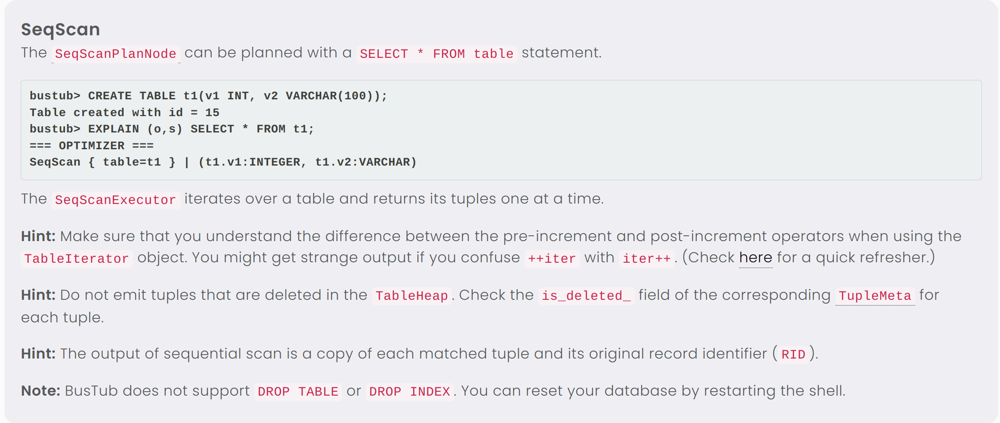

当我们运行它所要求的 SQL 语句之后

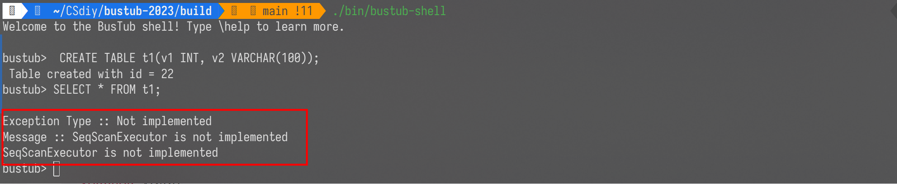

报错是由于 SeqScanExecutor 没有实现

所以现在应该找到该类所对应的文件

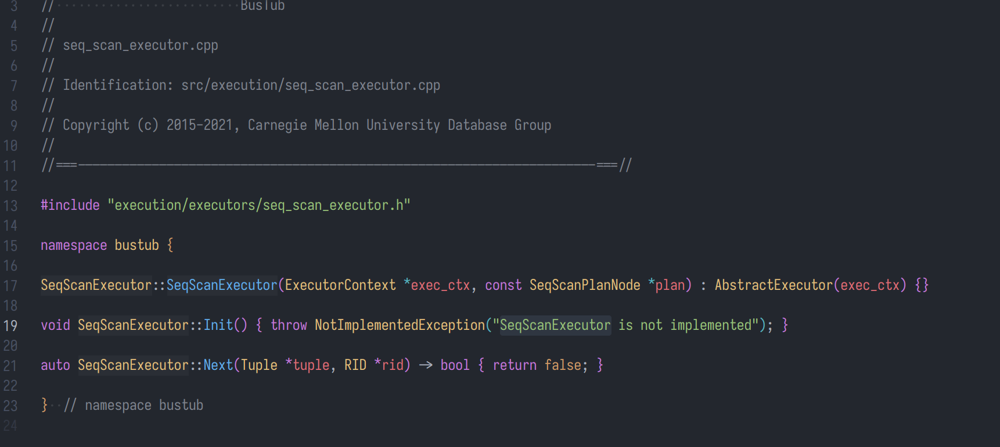

那么该项目是如何执行到这个位置呢？传入参数的含义分别是什么呢？

此时我们就可以通过 gdb 来定位执行流程

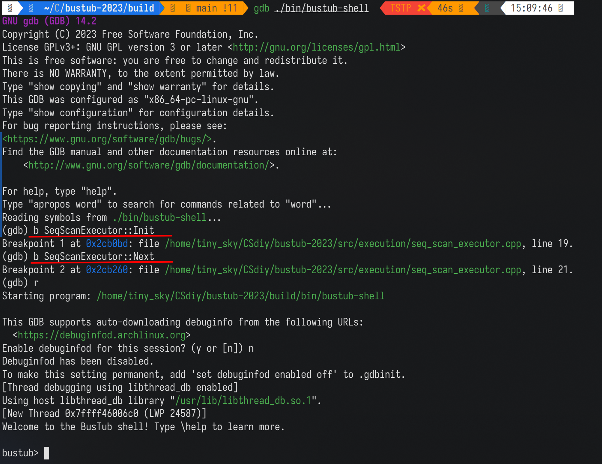

如上图， 在使用 gdb 启动项目之后，我们在需要定位的地方打上断点，之后就可以开始调试。

## 定位流程

输入对应的语句
```sql
CREATE TABLE t1(v1 INT, v2 VARCHAR(100));
SELECT * FROM t1;
```

我们发现程序停在了我们打断点的地方

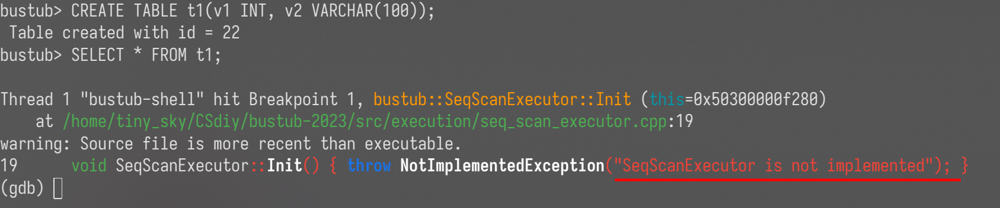

此时我们可以显示一下当前的堆栈信息

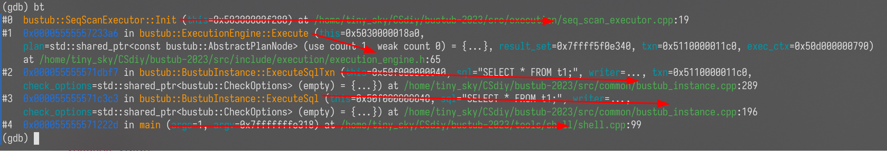

使用 bt 可以显示当前的调用流程，顺序是从下往上：

1. main 函数应该是主函数，最先被执行。(位于shell.cpp:99)
2. bustub::BustubInstance::ExecuteSql 函数，是位于 bustub 命名空间中的 BustubInstance 类中的方法，被 main 函数调用。(位于bustub_instance.cpp:196)
3. 同理，ExecuteSqlTxn 也是上面类中的方法，被 ExecuteSql 调用，之后去调用 Execute 函数
4. Execute 函数是 ExecutionEngine 中的方法，该函数最后调用 SeqScanExecutor::Init 函数。
5. SeqScanExecutor::Init 是需要我们完成的代码，执行初始化逻辑。

同时，你也可以看出部分的传入参数，例如 : sql="SELECT * FROM t1;" ,这里应该是将我们输入的数据当作参数来传递。

更具体的来分析，你可以使用 frame 命令来显示每一个栈帧。

这里使用 #4 栈帧来举例
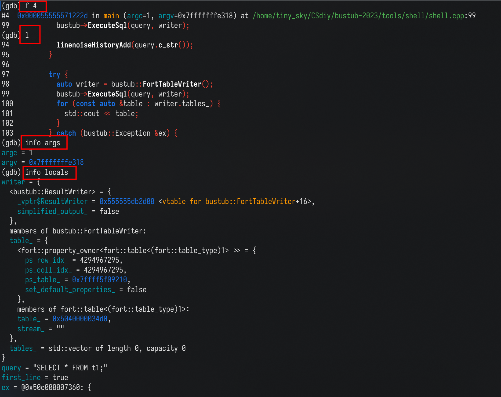

可以通过其他命令来进一步输出信息：
1. 你可以使用 list(l) 来输出当前的函数的位置
2. 你也可以输出更详细的变量信息：
- info args : 显示当前函数的传入参数
- info locals : 显示当前函数的变量信息
- p xxx ：指定显示 xxx 变量。

加上下面的命令使结构体输出更美观：
```gdb
set print pretty on
```

重复上面的步骤，结合源代码，重点关注所涉及的类：如何构造? 功能是什么？如何使用？

一般来说一个项目都会有相似的功能流程，可以使用上面的方法看懂已经实现好的流程代码，再去看看需要我们完成的部分。

## 分析流程
该过程需要对流程中涉及到的类与方法有一定的了解

### 对 shell.cpp 分析

我们发现：shell.cpp 前部分的代码主要是一些字符处理与预备工作，所以我们将我们的视野定位到下面的 try-catch 块中。

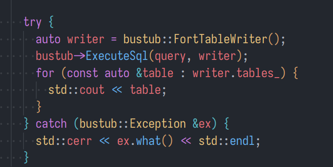

调试之后发现，这一块的代码逻辑是：
```cpp
 auto writer = bustub::FortTableWriter(); // 格式化输出方式，因为该数据库是以表的形式输出
 bustub->ExecuteSql(query, writer); // 具体的执行逻辑，将返回的结果集放在writer中
 for (const auto &table : writer.tables_) {
    std::cout << table; // 将结果集输出
 }
```

### 对 ExecuteSql 分析

该函数开启了事务，(事务在后续的任务中会涉及到，此处可以不用深入了解)

核心的代码就是下面的 ExecuteSqlTxn 函数。
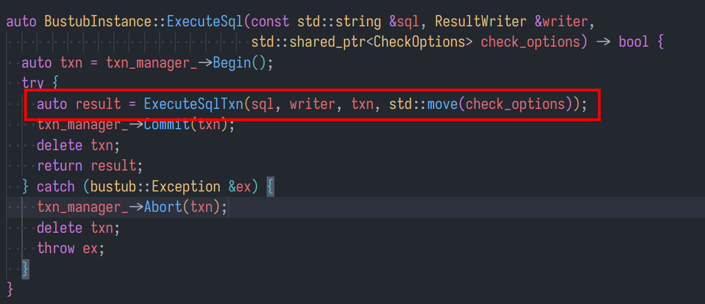

### 对 ExecuteSqlTxn 分析

该代码可以算是执行中的核心代码

1. 我们来慢慢分析：

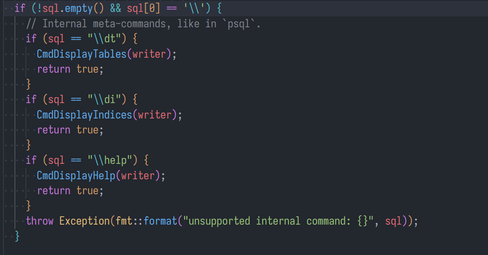

原来 bustub-shell 中的 `\dt`, `\di` 命令，并没有执行完整的调用逻辑，而是执行了对应的处理函数。

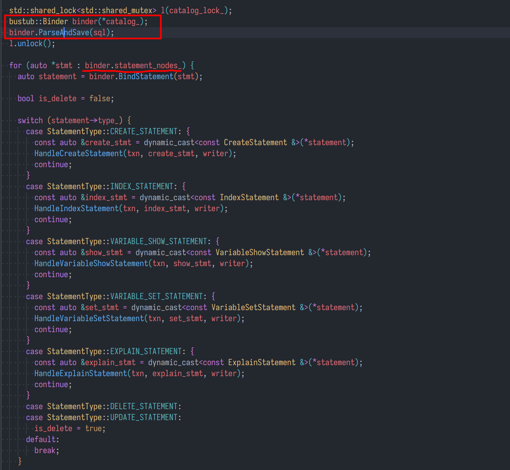

2. 首先是 Binder类，该类的具体实现大家可以之后深入分析

在这里的作用是 使用 Catalog 类来初始化，之后解析我们输入的字符串，生成表示查询的抽象语法树(AST)
```
Catalong 不知道？ 还记得我上面所说：该过程需要对流程中涉及到的类与方法有一定的了解！
sql 变量是不是感到似曾相识，没错，在上面gdb调试中的bt命令中出现过
```
随后就是根据不同的表达式类型去执行对应的逻辑。

```sql
CREATE TABLE t1(v1 INT, v2 VARCHAR(100));
```
所以在 bustub-shell 中，上面的语句可以直接执行，原因是判断到此处要求是创建一个表，直接就执行对应的函数了。

3. 这是核心的处理逻辑

大致可以分为以下几个模块：

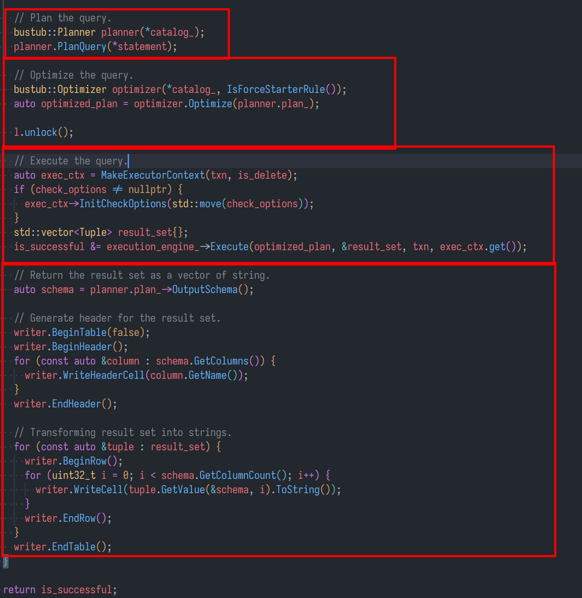

分别是: 查询计划，优化器，执行计划，结果格式化。

这里前三个模块都是重点，特别是优化器，这里的代码需要大家去认真理解。
具体的分析之后可以再详细说说。

对于p3，目前我们优先关注 Execute 执行函数。

### 对 Execute 分析

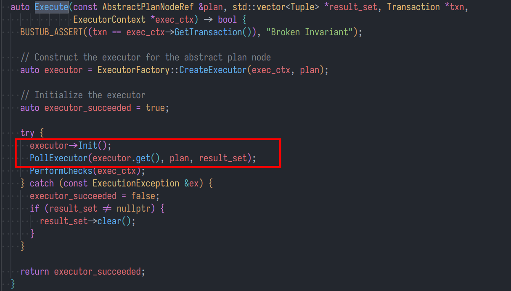

这里的调用流程主要也是创建一个执行器，然后在 try-catch 块中进行对应执行器的初始化与执行

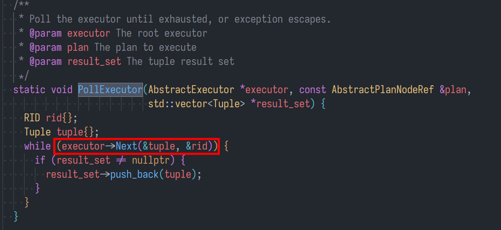

基于火山模型，在 PollExecutor 中循环调用具体的 next 方法获取 tuple ，之后将 tuple 放在结果集 result_set 中。

分析了这么多，终于明确了执行器 init 与 next 的调用流程，同时把 bustub-shell 的核心流程梳理了一遍。

## 后续调试

接下来就是，通过在需要关注的地方打断点，进行单步调试。

