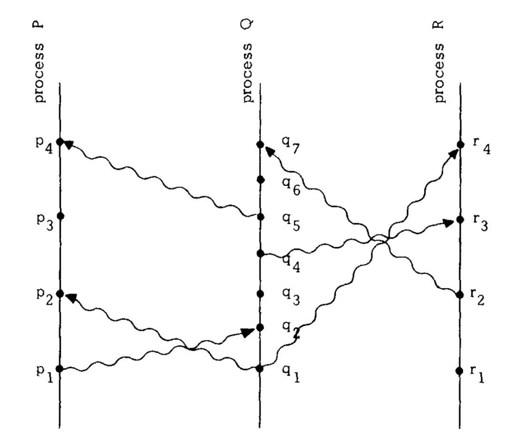
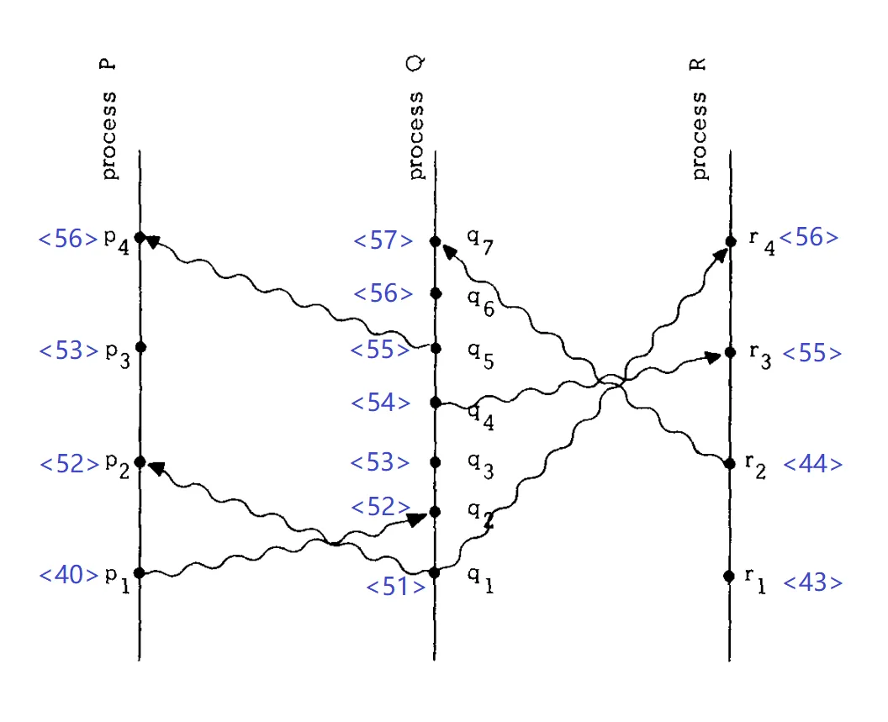

## 背景

论文从事件开始讲起，进程的执行被看作为一连串事件的持续发生，随后事件的排序问题很自然的被提出来，正如[一致性模型与共识](../distributed/consistency.md)一文中，对一致性的探讨。其目的是对事件的发生确定一个合理的顺序，这种顺序的确立，对于一个进程内部发生的事件通常是比较容易的，但是当涉及到不同进程上的事件，通常便没有那么直观。

<!--more-->

## 「Happened Before」

现实生活当中，事件的先后顺序往往依赖物理时钟，而物理时钟不可能百分百精确，因此，Lamport 在定义事件之间的关系的时候特意避开了物理时间。这就是著名的`「Happened Before」`关系（用符号“→”来表示）



在上图中，我们尝试对消息发送事件和消息接收事件进行排序。

在进程Q内部，q2表示一个消息接收事件，q4表示另一个消息发送事件，q2排在q4前面执行，所以q2→q4。

p1和q2分别表示同一个消息的发送事件和接收事件，所以p1→q2；同理，q4→r3。

“happened before”满足传递关系。由p1→q2，q2→q4和q4→r3，可以推出p1→r3。

但是这里的 “happened before” 关系，是一种偏序关系。比如p1和q1两个事件就是无法比较的，q4和r2也是无法比较的。无法比较的两个事件之间不满足“happened before”关系。

「Happened Before」关系定义与因果一致性中的因果顺序定义非常相似。实际上，因果一致性相当于将「Happened Before」关系应用在了读写操作之上。论文中看待「Happened Before」关系的另一种方式，相当于是说，a→b意味着事件a有可能在因果性上对事件b产生影响。如果两个事件谁也无法影响对方，那么它们就属于并发关系。
```txt
Another way of viewing the definition is to say that a→b means that it is possible for event a to causally affect event b. 
Two events are concurrent if neither can causally affect the other.
```

## 逻辑时钟

Lamport 在定义事件之间的「Happened Before」关系时避开了物理时间。这也就意味着，对事件的「发生时间」进行度量，只能根据逻辑时钟。

对于每一个发生的事件，它都能给出一个对应的数值，用 C(a) 来表示事件a发生时对应的时间戳。那么对于任意的事件a和b：如果a→b，那么必须满足C(a) < C(b)。



- 观察进程Q内部的两个事件，q2→q4，而C(q2) = 52 < C(q4) = 54。
- 同一个消息的发送事件和接收事件，p1→q2，而C(q1) = 40 < C(q2) = 52。

但是逻辑时钟是一个单向的条件，反过来是不成立的。比如：我们有C(p3) = 53 < C(q4) = 54，但不能说明 p3→q4 成立。也就是说，虽然对任意两个事件来说，它们各自对应的时间戳在数值上都可以比较大小，但据此并不能得到两个事件之间存在「Happened Before」关系。从本质上看，时钟条件的这种单向推导逻辑，是由「Happened Before」关系的偏序特性所决定的。

## 本地物理时钟

那么是否逻辑时钟就可以彻底解决问题？答案是否定的。

例如，Alice 与 Bob 在不同的地方关注一场球赛，Alice发出请求A查询比分后，得到结果后电话告知Bob去查询，Bob发出请求B。由于分布式系统采用逻辑时钟，可能为请求B打上比请求A更小的时间戳，导致Bob查询到旧比分。逻辑时钟忽略物理时间和因果关系，只关注事件的偏序关系，系统无法意识到Alice和Bob之间的电话通知，产生了异常行为。

为避免这种异常，需引入物理时钟，并在分布式系统中为每个进程配置本地物理时钟，从而结合物理时间与逻辑时钟处理事件，消除异常现象。

但是物理时钟需要多精确才行？

是否可以存在一个时钟同步算法，对于任意两个有偏序关系的事件，我们的物理时钟要保证总是会为后一个事件打上一个更大的时间戳。

要实现这个目标，我们面临的障碍主要来源于物理时钟的两种误差：

- 时钟的运行速率跟真实时间的流逝速率可能有差异
- 任意两个时钟的运行速率有差异，它们的读数会漂移得越来越远

Lamport 在论文中提出的物理时钟同步算法，做的事情其实就是：将这两种时钟误差考虑在内，通过在时钟之间不断交换信息并按照一定规则调整时钟读数。

## 总结
实际上，Lamport 提出的逻辑时钟可以说是分布式一致性算法的开山鼻祖，后续的所有分布式算法都有它的影子。逻辑时钟定义了分布式系统里面的时间概念，解决了分布式系统中区分事件发生的时序问题。

## 参考

- [Time, Clocks, and theOrdering of Events ina Distributed System ](https://lamport.azurewebsites.net/pubs/time-clocks.pdf)
- [条分缕析分布式：因果一致性和相对论时空](https://mp.weixin.qq.com/s?__biz=MzA4NTg1MjM0Mg==&mid=2657261809&idx=1&sn=cff64fe049a8a04ae719b34e7bf57dd1&scene=21#wechat_redirect)
- [分布式领域最重要的一篇论文，到底讲了什么？](https://mp.weixin.qq.com/s/FZnJLPeTh-bV0amLO5CnoQ)

