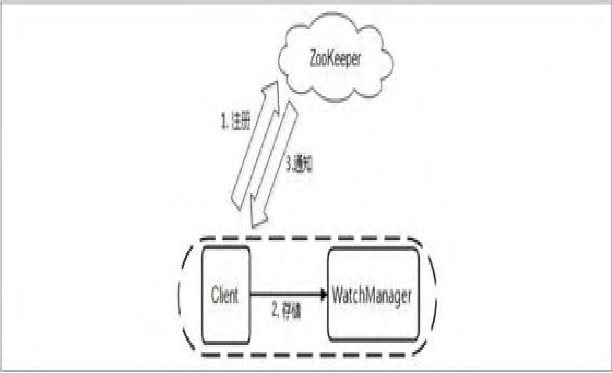
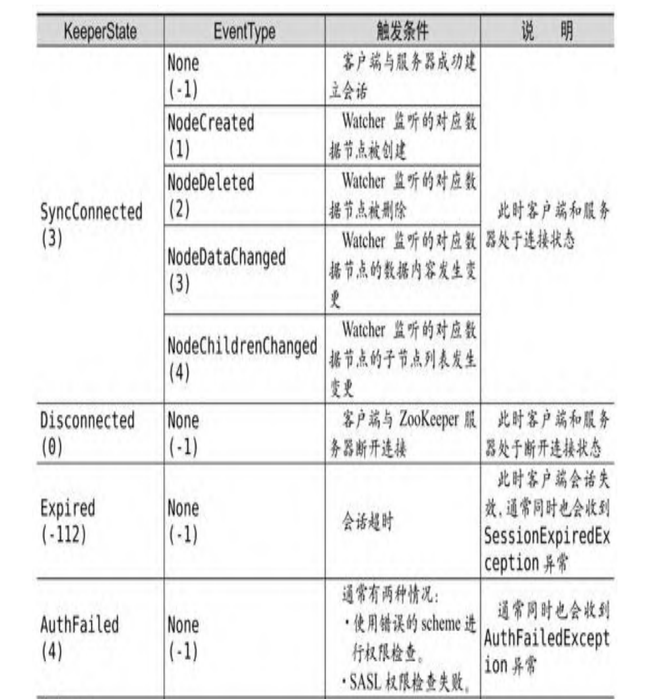
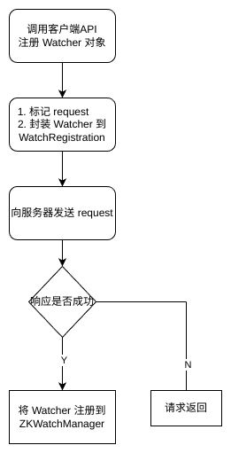
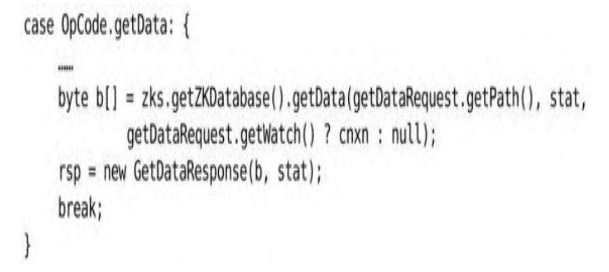

《从Paxos到Zookeeper》读书笔记，Watcher 监听机制是 Zookeeper 中非常重要的特性，许多 Zookeeper 的使用场景其实都建立在 Watcher 机制之上，例如：分布式锁、配置管理、发布/订阅、命名服务

<!--more-->

## Watcher 介绍

基于 Zookeeper上创建的节点，可以对这些节点绑定监听事件，比如可以监听节点数据变更、节点删除、子节点状态变更等事件。它类似于订阅的方式，即客户端向服务端注册指定的 watcher ，当服务端符合了 watcher 的某些事件或要求则会向客户端发送事件通知，客户端收到通知后找到自己定义的 Watcher 然后 执行相应的回调方法。

ZooKeeper 的 Watcher 机制，总的来说可以分为三个过程：

- 客户端注册 Watcher
- 服务器处理 Watcher
- 客户端回调 Watcher

#### Watcher 事件

同一个事件类型在不同的通知状态中代表的含义有所不同，下表列举了常见的通知状态和事件类型。

## 核心流程

#### 客户端注册 Watcher

由两种方式注册 Watcher
- 创建 ZooKeeper 客户端实例时，传递 Watcher
- 调用 API 接口时，附带注册 Watcher

在创建一个 ZooKeeper 客户端对象实例时，可以向构造方法中传递一个Watcher，这个 Watcher 的生命周期将会一直持续到本次会话结束或者被触发。另外，ZooKeeper 客户端也可以通过 getData、getChildren和exist 三个接口来注册 Watcher。上面的两种方式注册的 Watcher 都只会被触发一次

无论使用哪种方式，他们的工作方式都是一致的，这里用 getDate 说明。

在向 getData 接口注册 Watcher 后，客户端首先会对发送请求 request 进行标记，将其设置为“使用Watcher监听”,这将会创建一个携带 Watcher 注册信息的 WatchRegistration 对象，用于暂时保存数据节点的路径和 Watcher 的对应关系。

在 ZooKeeper 中，Packet 被看作一个最小的通信协议单元，用于进行客户端与服务端之间的网络传输，任何需要传输的对象都需要包装成一个 Packet 对象。

因此 WatchRegistration 会被封装到 Packet 中去，然后放入发送队列中等待客户端发送。这里需要注意的是：如果客户端注册的所有 Watcher 都被传递到服务端的话，那么服务端肯定会出现内存紧张或其他性能问题，ZooKeeper 为了避免这个问题，在底层实际的网络传输序列化过程中，并没有将 WatchRegistration 对象完全地序列化到底层字节数组中去，而是只将 requestHeader 和 request 两个属性进行序列化。

随后，ZooKeeper 客户端会向服务端发送这个请求，同时等待请求的返回。请求发送后，会由客户端 SendThread 线程的 readResponse 方法负责接收来自服务端的响应。finishPacket 方法会从 Packet 中取出对应的 Watcher 并注册到 ZKWatchManager 中去。

## 服务端处理 Watcher

服务端受到来自客户端的请求后，会从 requestHeader 解析出本次操作是否需要注册 Watcher

当需要注册 Watcher 时，服务端就会将当前的 ServerCnxn 对象和数据节点路径传入 WatchManager。ServerCnxn 代表了一个 ZooKeeper 客户端和服务器之间的连接，当事件触发时，对应通知会通过 ServerCnxn 发送给客户端。

WatchManager 是 ZooKeeper 服务端 Watcher 的管理者，其内部管理的watchTable 和 watch2Paths 两个存储结构，分别从两个维度对 Watcher 进行存储。
- watchTable 是从数据节点路径的粒度来托管Watcher。
- watch2Paths 是从 Watcher 的粒度来控制事件触发需要触发的数据节点。

同时，WatchManager 还负责 Watcher 事件的触发，并移除那些已经被触发的 Watcher。

#### Watcher 触发

上文我们以 getDate 说明，所以其触发条件是：Watcher监听的对应数据节点的数据内容发生变更。

所以当服务端修改数据时，会在对应的函数末尾调用 WatchManager 的 triggerWatch 方法来触发相关事件,具体的步骤如下：
1. 封装WatchedEvent\
  首先将通知状态（KeeperState）、事件类型（EventType）以及
节点路径（Path）封装成一个WatchedEvent对象。
2. 查询Watcher\
   根据数据节点的节点路径从 watchTable 中取出对应的 Watcher。如
果没有找到 Watcher，说明没有任何客户端在该数据节点上注册过
 Watcher，直接退出。而如果找到了这个 Watcher，会将其提取出来，
同时会直接从 watchTable 和 watch2Paths 中将其删除(从这里我们也
可以看出，Watcher 在服务端是一次性的，即触发一次就失效了)。
3. 调用 process 方法来触发Watcher\
   在这一步中会逐个依次地调用从步骤2中找出的所有 Watcher 的
 process 方法，本质上是调用对应的 ServerCnxn 向客户端发送通知

## 客户端回调Watcher

对于来自服务端的响应，客户端都是由SendThread 来接受的，主要分为下面几个步骤：
1. 反序列化\
   客户端接到请求后,将字节流转换成 WatchedEvent 对象
2. 处理 chrootPath\
   如果客户端设置了 chrootPath 属性，那么需要对服务端传过来的
完整的节点路径进行 chrootPath 处理，生成客户端的一个相对节点路
径。
3. 回调 Watcher\
   将 WatchedEvent 对象交给 EventThread 线程，在下一个轮询周期中进行Watcher 回调。

所以当 SendThread 接收到服务端的通知事件后，会将字节流解析为 WatchedEvent 对象并传给 EventThread 线程,EventThread 中通过 WatchedEvent 中的事件类型从 ZKWatchManager 中取出所有相关的 Watcher 并将其放入 waitingEvents 这个队列中去，WaitingEvents 是一个待处理的 Watcher 队列，EventThread 线程每次都会从 waiting Events 队列中取出一个Watcher，并进行串行同步处理。

## Watcher 特性总结

本文中，我们分别从 Watcher 注册、服务端处理 Watcher 以及客户端回调 Watcher 三方面分阶段讲解了 ZooKeeper 的 Watcher 工作机制。我们不难发现ZooKeeper的Watcher具有以下几个特性。

- 一次性\
  无论是服务端还是客户端，一旦一个
Watcher 被触发，ZooKeeper 都会将其从相应的存储中移除
- 客户端串行执行\
  客户端 Watcher 回调的过程是一个串行同步的过程，这为我们保
证了顺序。
- 轻量\
  WatchedEvent 是 ZooKeeper 整个 Watcher 通知机制的最小通知
单元，它只包含三部分内容：通知状态、事件类型和节点路径。也就是说，Watcher 通知非常简单，只会告诉客户端发生了事件，而不会说明事件的具体内容。

另外，客户端向服务端注册 Watcher 的时候，并不会把客户端真实的 Watcher 对象传递到服务端，仅仅只是在客户端请求中进行 Watcher 标记。